# HW - Audio Visualizer - Part I

[I. Overview](#overview)

[II. Get Started](#start)

[III. About Audio Graphs & Sampling](#audio-graphs-and-sampling)

[IV. Playing the Audio](#code-audio)

[V. Visualizing the Audio](#code-visualize)

[XXX. Submission](#submission)

<hr/>

<a id="overview" />

## I. Overview
In Part I of this HW, you will be learning about the HTML5 [WebAudio API](https://developer.mozilla.org/en-US/docs/Web/API/Web_Audio_API), and how to utilize it to create an audio visualizer. Topics explored:

1. [Audio Routing Graph](https://developer.mozilla.org/en-US/docs/Web/API/Web_Audio_API/Basic_concepts_behind_Web_Audio_API#Audio_graphs)


2. [`AnalyserNode`](https://developer.mozilla.org/en-US/docs/Web/API/AnalyserNode)
  - sampling & bins
  - frequency data - `analyserNode.getByteFrequencyData(data);`
  - waveform data  - `analyserNode.getByteTimeDomainData(data);`
  
3. [JavaScript Typed Arrays](https://developer.mozilla.org/en-US/docs/Web/JavaScript/Typed_arrays) - frequency and waveform data is passed *by reference* to these non-resizable typed arrays.

<a id="cors-restrictions" />

4. [CORS Restrictions](https://developer.mozilla.org/en-US/docs/Web/HTTP/CORS) - ("Cross-origin Resource Sharing") means that you can't run the visualizer start files locally off of your hard drive. You might see an error message like this:

**`MediaElementAudioSource outputs zeroes due to CORS access restrictions for file:///Users/...../soundfile.mp3`**

**Solutions to CORS issues:**
- Run the code off of a web server, which you can do by uploading your code to Banjo
- Use an IDE like [Brackets](http://brackets.io) - which creates a local web server ("Live Preview") for you to run your code on
- Visual Studio Code has a similar feature called [Live Server](https://marketplace.visualstudio.com/items?itemName=ritwickdey.LiveServer)
- [You can also create a local web server using Python](https://developer.mozilla.org/en-US/docs/Learn/Common_questions/set_up_a_local_testing_server) on your local machine
- NodeJS can also run a local web server for you: https://www.npmjs.com/package/http-server
- [Firefox Developer Edition](https://www.mozilla.org/en-US/firefox/developer/) (and other browsers) let you turn of CORS restrictions, so you don't need a web server --> https://pointdeveloper.com/how-to-bypass-cors-errors-on-chrome-and-firefox-for-testing/

<hr/>

<a id="start" />

## II. Get Started

- Here we begin create the Audio Visulizer HW that will become the foundation of your Project 2
- We are going to take the time to architect it properly - which may look like a bit of *over engineering* - but it will pay off in the long run (i.e. when you extend this app to create your Project 1)

1) Create a folder named **web-audio-hw**

2) Download the media files from myCourses and place them in the **web-audio-hw** folder

3) Create **index.html** in the **web-audio-hw** folder - here's the code:

**index.html**

```html
<!DOCTYPE html>
<html lang="en">
<head>
	<meta charset="utf-8" />
	<title>Audio Visualizer</title>
	<link href="styles/default-styles.css" type="text/css" rel="stylesheet" />
	<script src="./src/loader.js" type="module"></script>
</head>
<body>
<main>
	<canvas width="800" height="400"></canvas>
	<div id="controls">
		<section>
			<button id="playButton" data-playing="no"></button>
			<button id="fsButton">Full Screen</button>
		
			<label>Track: 
				<select id="trackSelect">
					<option value="media/New Adventure Theme.mp3" selected>New Adventure Theme</option>
					<option value="media/Peanuts Theme.mp3">Peanuts Theme</option>
					<option value="media/The Picard Song.mp3">The Picard Song</option>
				</select>
			</label>
		</section>
		
		<section>
			Volume: <input type="range" id="volumeSlider" min="0" max="2" value="1" step="0.01">
			<span id="volumeLabel">???</span>
		</section>
	</div>
</main>
</body>
</html>
```

- note that the browser knows that we are using the ES6 Module pattern here (because of `type="module"`> in the &lt;script> tag)

<hr/>

4) Here's the style sheet - it goes in a folder named **styles**:

**styles/default-styles.css**

```css
body {
	background: #eeeeee;
	font-family: tahoma, verdana, sans serif;
}

canvas {
	margin-left: 1rem;
	margin-top: 1rem;
	margin-bottom: 1rem;
	box-shadow: 4px 4px 8px rgba(0,0,0,0.5);
	background: #fafafa;
}

#controls{
  margin-left: 1rem;
}

#volumeLabel{
  margin-left: 1rem;
}

section{
  margin-bottom: 1rem;
}

#playButton{
  font-size: 1.2rem;
  width: 6rem;
}

button[data-playing="yes"]:after{
  content: "Pause";
}

button[data-playing="no"]:after{
  content: "Play";
}

#fsButton{
  font-size: 1.2rem;
  width: 8rem;
}
```

<hr/>

5) Here's **loader.js** - it goes in a folder named **src**:

**src/loader.js**
```js
import * as main from "./main.js";
window.onload = ()=>{
	console.log("window.onload called");
	// 1 - do preload here - load fonts, images, additional sounds, etc...
	
	// 2 - start up app
	main.init();
}
```

<hr/>

6) Here's **utils.js** - it goes in the **src** folder:

**src/utils.js**

```js
// Why are the all of these ES6 Arrow functions instead of regular JS functions?
// No particular reason, actually, just that it's good for you to get used to this syntax
// For Project 2 - any code added here MUST also use arrow function syntax

const makeColor = (red, green, blue, alpha = 1) => {
  return `rgba(${red},${green},${blue},${alpha})`;
};

const getRandom = (min, max) => {
  return Math.random() * (max - min) + min;
};

const getRandomColor = () => {
	const floor = 35; // so that colors are not too bright or too dark 
  const getByte = () => getRandom(floor,255-floor);
  return `rgba(${getByte()},${getByte()},${getByte()},1)`;
};

const getLinearGradient = (ctx,startX,startY,endX,endY,colorStops) => {
  let lg = ctx.createLinearGradient(startX,startY,endX,endY);
  for(let stop of colorStops){
    lg.addColorStop(stop.percent,stop.color);
  }
  return lg;
};


const goFullscreen = (element) => {
	if (element.requestFullscreen) {
		element.requestFullscreen();
	} else if (element.mozRequestFullscreen) {
		element.mozRequestFullscreen();
	} else if (element.mozRequestFullScreen) { // camel-cased 'S' was changed to 's' in spec
		element.mozRequestFullScreen();
	} else if (element.webkitRequestFullscreen) {
		element.webkitRequestFullscreen();
	}
	// .. and do nothing if the method is not supported
};

export {makeColor, getRandomColor, getLinearGradient, goFullscreen};
```

<hr/>

7) Finally, here's **main.js** - it goes in the **src** folder:

**src/main.js**

```js
/*
	main.js is primarily responsible for hooking up the UI to the rest of the application 
	and setting up the main event loop
*/

// We will write the functions in this file in the traditional ES5 way
// In this instance, we feel the code is more readable if written this way
// If you want to re-write these as ES6 arrow functions, to be consistent with the other files, go ahead!

import * as utils from './utils.js';

// 1 - here we are faking an enumeration
const DEFAULTS = Object.freeze({
	sound1  :  "media/New Adventure Theme.mp3"
});

function init(){
	console.log("init called");
	console.log(`Testing utils.getRandomColor() import: ${utils.getRandomColor()}`);
	let canvasElement = document.querySelector("canvas"); // hookup <canvas> element
	setupUI(canvasElement);
}

function setupUI(canvasElement){
  // A - hookup fullscreen button
  const fsButton = document.querySelector("#fsButton");
	
  // add .onclick event to button
  fsButton.onclick = e => {
    console.log("init called");
    utils.goFullscreen(canvasElement);
  };
	
} // end setupUI

export {init};
```

<hr/>

8) Tired of copy/pasting?
 - don't worry - you'll soon be doing all the typing yourself!
 - test it by opening **index.html** in Chrome - don't forget that you need to be [running on a web server](#cors-restrictions)
 - you should see the console logs like in the screen shot below
 - the "Full Screen" button should work - go ahead and test it
 
 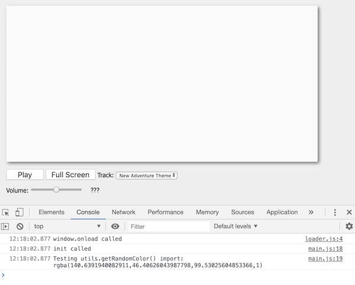
 
<hr/>

<a id="audio-graphs-and-sampling" /> 

## III. Audio Graphs & Sampling

### III-A. A simple audio graph
- The Web Audio API specification describes a high-level JavaScript API for processing and synthesizing audio in web applications. The top level class of the API is [`AudioContext`](https://developer.mozilla.org/en-US/docs/Web/API/Web_Audio_API)
- To play sounds using web audio, we connect a sound *source* to a *destination*.
- The primary paradigm used by WebAudio is that of an *audio routing graph*, where [`AudioNode`](https://developer.mozilla.org/en-US/docs/Web/API/AudioNode) objects are connected together to define the overall audio rendering:
  - mathematically this is a [Directed Graph](https://en.wikipedia.org/wiki/Directed_graph)

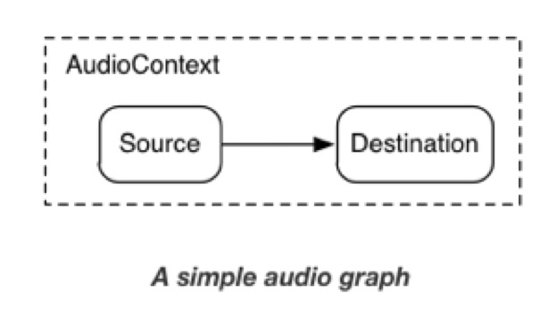

<hr>

### III-B. An audio graph for controlling the volume of a sound

- Below we have an example of an [`AudioContext`](https://developer.mozilla.org/en-US/docs/Web/API/AudioContext) graph with a [`GainNode`](https://developer.mozilla.org/en-US/docs/Web/API/GainNode) (volume) between the source node and the destination node. The [`AudioNode`]((https://developer.mozilla.org/en-US/docs/Web/API/AudioNode) ) instances you place between the source and the destination allow us to manipulate and/or analyse the audio stream.

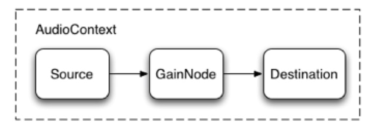

<hr>

### III-C. An audio graph for analyzing the frequency distribution of a sound

- In this HW, we will be placing an [`AnalyserNode`](https://developer.mozilla.org/en-US/docs/Web/API/AnalyserNode) between the source and the destination. This analyser node will not actually change the sound, but it will allow us to analyse it:
  - http://webaudio.github.io/web-audio-api/#the-analysernode-interface

- The [`AnalyserNode`](https://developer.mozilla.org/en-US/docs/Web/API/AnalyserNode) gives us access to the frequency data of the sound, as well as the waveform data (think “change in values” like an oscilloscope). We will then read and visualize this data by drawing onto our canvas tag.

***\*\* Note the British spelling of “Analyser” \*\****

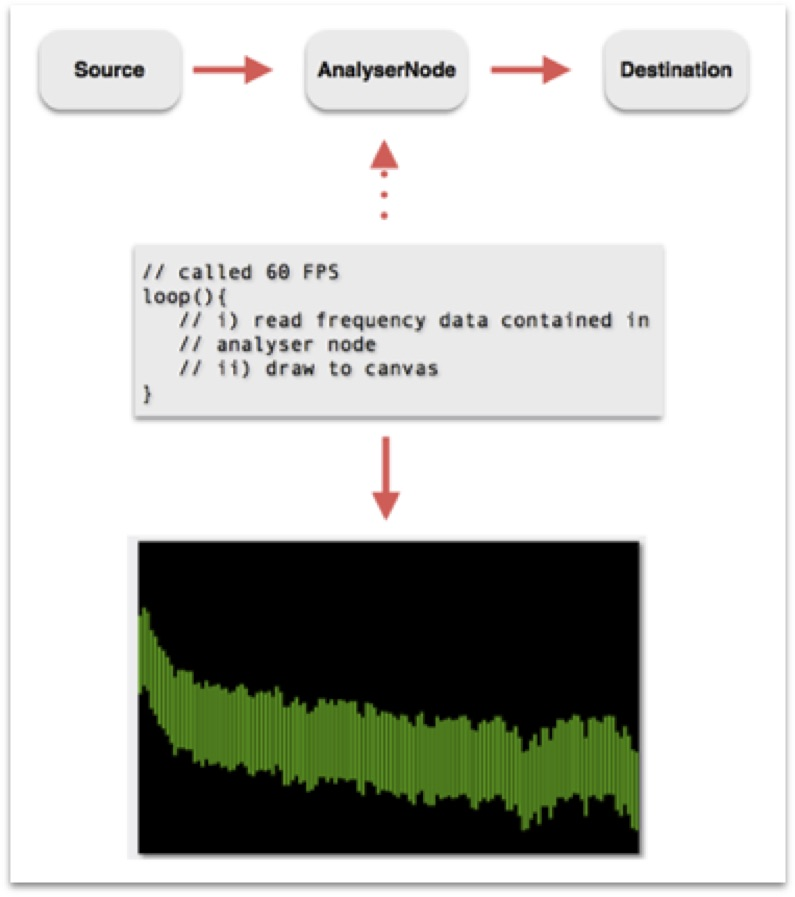


***We'll talk more about the analyser node soon!***


<hr>

<a id="code-audio" />

## IV. Playing the Audio

1) To set up the audio graph, play the audio, and analyse the audio, we first need to create a new ES6 module to hold all of the audio-related code. Let's name this module **audio.js**:
  - here's some pseudo-code you can copy/paste to get started:

**src/audio.js**

```js
// 1 - our WebAudio context, **we will export and make this public at the bottom of the file**


// **These are "private" properties - these will NOT be visible outside of this module (i.e. file)**
// 2 - WebAudio nodes that are part of our WebAudio audio routing graph


// 3 - here we are faking an enumeration


// 4 - create a new array of 8-bit integers (0-255)
// this is a typed array to hold the audio frequency data


// **Next are "public" methods - we are going to export all of these at the bottom of this file**

// 1 - The || is because WebAudio has not been standardized across browsers yet


// 2 - this creates an <audio> element


// 3 - have it point at a sound file


// 4 - create an a source node that points at the <audio> element


// 5 - create an analyser node
// note the UK spelling of "Analyser"

/*
// 6
We will request DEFAULTS.numSamples number of samples or "bins" spaced equally 
across the sound spectrum.

If DEFAULTS.numSamples (fftSize) is 256, then the first bin is 0 Hz, the second is 172 Hz, 
the third is 344Hz, and so on. Each bin contains a number between 0-255 representing 
the amplitude of that frequency.
*/ 

// fft stands for Fast Fourier Transform


// 7 - create a gain (volume) node


// 8 - connect the nodes - we now have an audio graph

// make sure that it's a Number rather than a String
```

<hr>

2) Oh, you say you'd like a little more guidance?
  - Here you go - be sure to type the code near the associated comments that you copy/pasted above. The screenshot below represents the entirety of our **audio.js** file for this exercise - we're done with this file after you have completed this step.

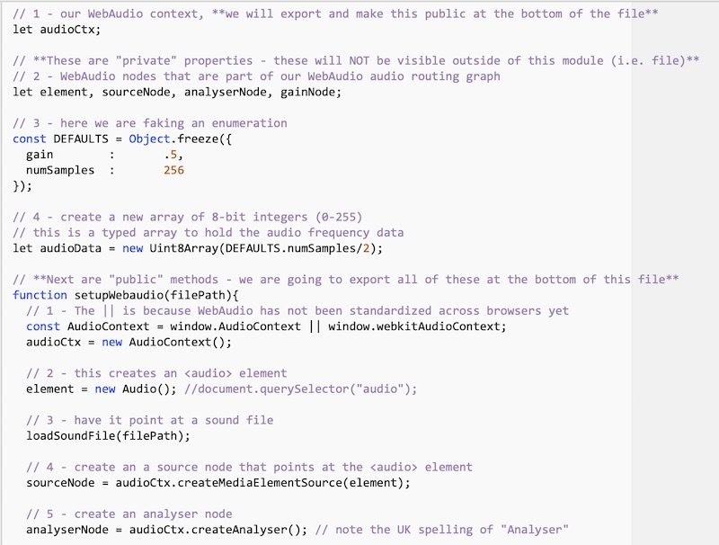

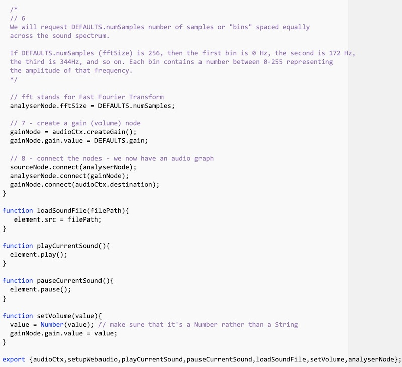

3) There's a lot of well commented code here:
  - the purpose of this code is to create our "4 node" audio graph:
    - **Source** (*i.e. MP3*) --> **Analyser** --> **Gain** --> **Destination**  (*i.e. Speakers*)
  - note that many of the variables and functions are public (have been exported), this is so that **main.js** can pause and play the sound, load a new sound, change the volume, and so on 
  - please read over the comments and be sure you understand what is going on. We will also talk about this in class, but if there is something in here you don't understand, ***ASK US*** about it

4) In order to use call these audio functions in our main program, you'll need to import them into **main.js**:

`import * as audio from './audio.js';`

5) Now add this line of code to the top of `main.init()` - this is the code that loads the **New Adventure Theme.mp3** sound file and sets up the WebAudio context for us.

`audio.setupWebaudio(DEFAULTS.sound1);`

6) Reload the page, and let's use the debugger to be sure everything is loading as it is supposed to. Go ahead and put a breakpoint at the bottom of `main.init()` - Looks good!

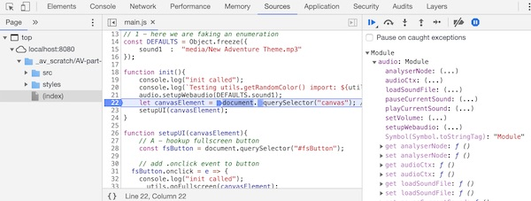

6) Test the `audio` module:
  - on the right-side of the debugger, you can see the `audio` module and all of its "public" functions, let's test one of them with the program still paused and "broken" in the `init` method:
    - switch to the console
    - type `audio.playCurrentSound()` - hit enter - then hit the debugger's "continue" button - the "adventure" sound should play
    
7) A button would be a handy way to play and pause the sound. To hook up the play button, add the following code to `setupUI()`:

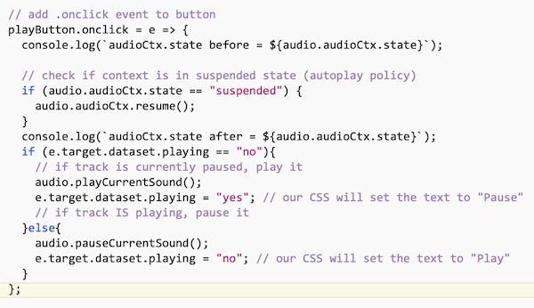

- note that a lot of this code is here because of Chrome's restrictive "autoplay" policy - you can read about that here: https://developers.google.com/web/updates/2018/11/web-audio-autoplay
- anyway, reload the page, successively clicking the play button should toggle between "play and "pause" states. 
- be sure to look over how the `dataset.playing` property of the button interacts with the CSS (see **default-styles.css**) to change the text back and forth

8) Now that we have the audio playing working, be sure to go back and look over [III. Audio Graphs & Sampling](#audio-graphs-and-sampling) as well as the code in **audio.js** and look over how the audio graph was constructed

9) Let's get the volume slider working - here's the code for that - be sure to type in the comments too.

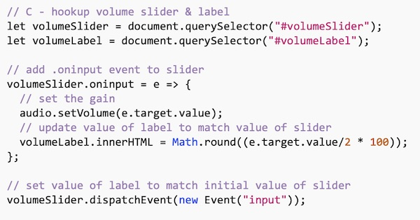

- test the app by hitting the play button and dragging the slider knob:
  - the volume should change
  - the label value should update
- recall that the `oninput` event of the slider is called whenever the user *moves* the slider - they don't have to release the knob (FYI - the event that gets called when the user *releases* the slider knob is `onchange`)


<hr>

<a id="code-visualize" />

## V. Visualizing the Audio

- So we have playing/pausing working, and we have an analyser node hooker up to the audio routing graph

### V-A. What does the audio frequency data look like?

- Below, see the raw frequency data (byte frequency data) array as seen in the debugger. We’ve asked for 64 samples that evenly sample the frequency range of the sound from 0 to 21050 Hz (21.05 kHz):
  - array element 0 represents: 0 - 329 Hz
  - array element 1 represents: 329 - 658 Hz
  - array element 63 represents: 20721 - 21050 Hz
- The values in the array elements represent the *loudness* of each frequency *bin*. They are an average of all of the frequencies in the range of that bin:
  - the range of the values is 0-255, where 0 is no loudness, and 255 is the maximum loudness.
  - you can also request the byte frequency data as percentages if you wish, from 0-1.0
- Here we are sampling this data at 60 frames per second. With most sounds, the contents of this array will therefore change every 1/60th of a second as the &lt;audio> player progresses through the sound.

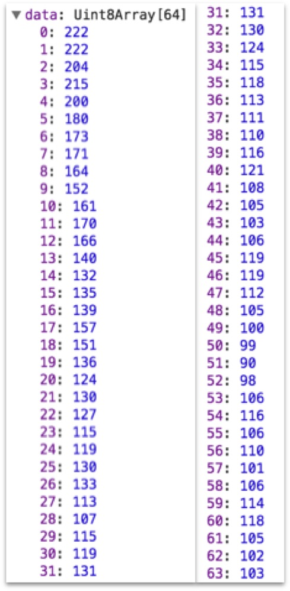

- Note: You can also get waveform data that represents the change in the frequency bins, similar to what you might see in an oscilloscope:
  - to see how to access this waveform data, look for the following line of commented out code in this HW: `analyserNode.getByteTimeDomainData(data); // waveform data`

<hr>

### V-B. Visualizing the audio frequency data

- Below is an example of what we might get from one of these 1/60th of a second snapshots of the byte frequency data.

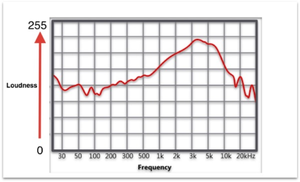

- If we sample the audio data, draw points to the screen, and update it every 1/60 of a second, we’ll get animation!

<hr>

### V-C. Frequency ranges

- Normal Speech falls between 500 Hz to 2 kHz:
  - Low frequencies are vowels and bass
  - High frequencies are consonants
- Standard Piano Keyboard: 27.5 Hz to 4186 Hz
- Middle C: 261.6 Hz
- High-pitched Scream: 3000 Hz
- Other frequencies:
  - https://www.gearslutz.com/board/electronic-music-instruments-and-electronic-music-production/817538-instrument-frequency-chart-electronic-music-what-goes-where.html

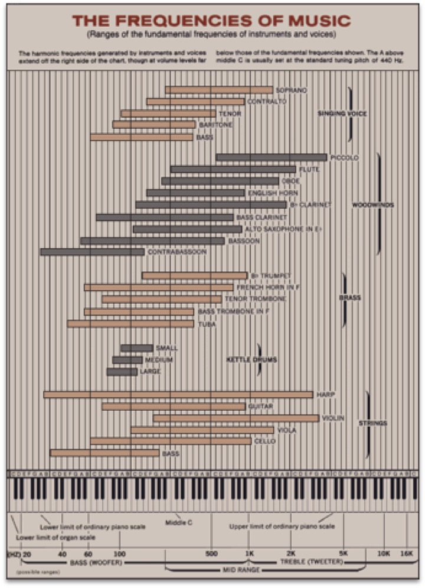

<hr>

<a id="terms" />

## VI. Terms you should know

- Directed Graph
- Audio Routing Graph Nodes:
  - Source
  - Destination
  - Effect Node
  - Analyser Node
- Analyser Node:
  - frequency data
  - waveform data
  - sampling rate
  - bin
  - loudness
  - amplitude
  
  


<hr>

<a id="submission" />

## XXX. Submission

- also see the mycourses.rit.edu dropboxes for due date
