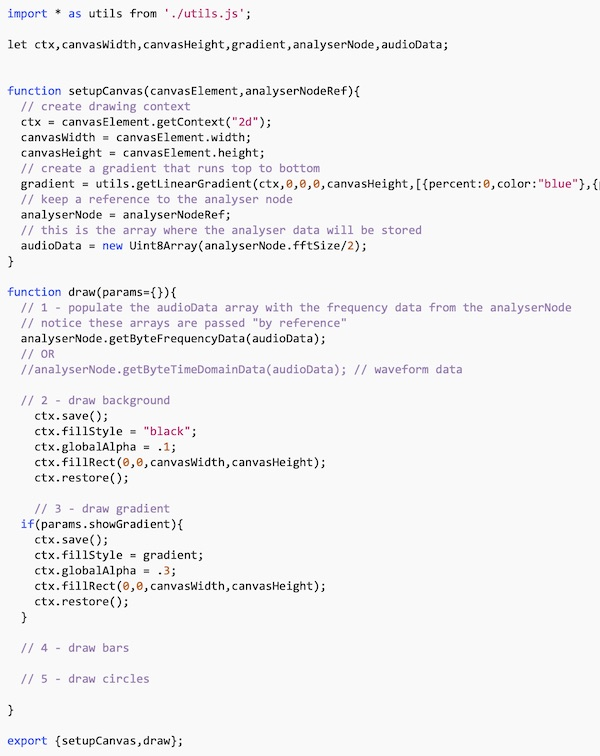
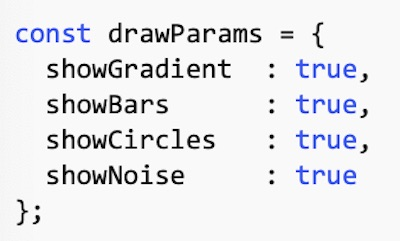
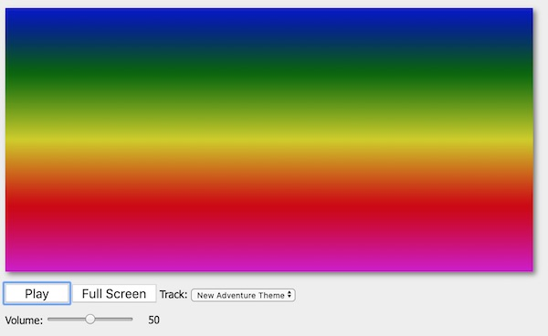
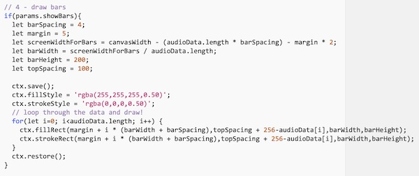
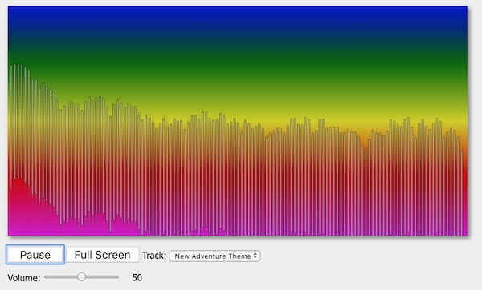
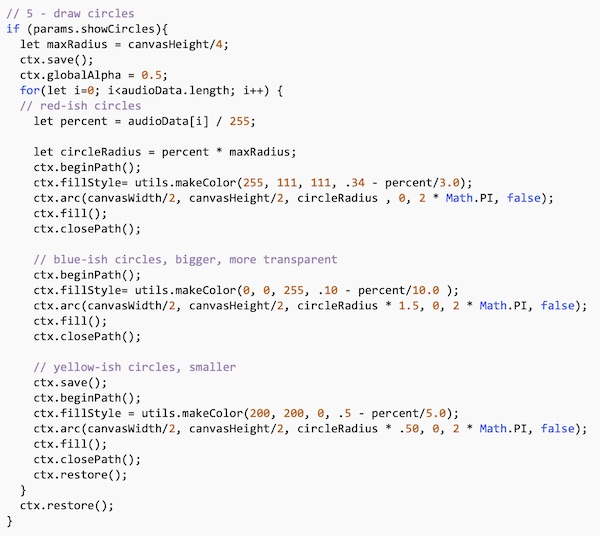
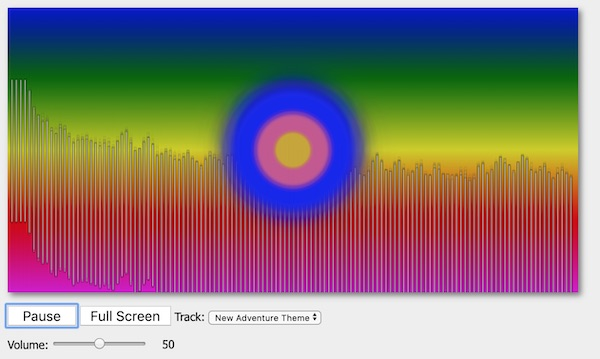
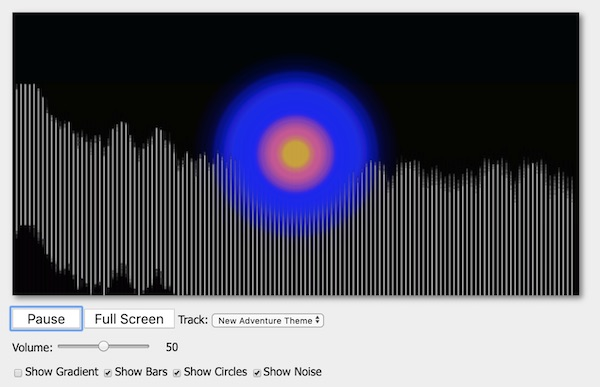

# HW - Audio Visualizer - Part II

[I. Overview](#overview)

[II. Get Visualizing!](#get-visualizing)

[III. Homework](#homework)

<hr><hr>

<a id="overview" />

## I. Overview

- Now we are finally going to draw something to the screen that will visualize some of the aspects of an audio signal
- The results below are not that pretty - by design -  for your project you will need to make it look much better!

<hr>

<a id="get-visualizing" />

## II. Get Visualizing

- Make a copy of the main project folder (and all of the files/folders that are in it) from Part I, and name this one **web-audio-hw-2**

<hr>

## II-A. Create *canvas.js*

<hr>

1) We're going to draw on the canvas this time, so let's create a new module to handle all of the drawing - **canvas.js**

**src/canvas.js**

```js
/*
	The purpose of this file is to take in the analyser node and a <canvas> element: 
	  - the module will create a drawing context that points at the <canvas> 
	  - it will store the reference to the analyser node
	  - in draw(), it will loop through the data in the analyser node
	  - and then draw something representative on the canvas
		- maybe a better name for this file/module would be *visualizer.js* ?
*/

import * as utils from './utils.js';

let ctx,canvasWidth,canvasHeight,gradient,analyserNode,audioData;


function setupCanvas(canvasElement,analyserNodeRef){
	// create drawing context
	ctx = canvasElement.getContext("2d");
	canvasWidth = canvasElement.width;
	canvasHeight = canvasElement.height;
	// create a gradient that runs top to bottom
	gradient = utils.getLinearGradient(ctx,0,0,0,canvasHeight,[{percent:0,color:"blue"},{percent:.25,color:"green"},{percent:.5,color:"yellow"},{percent:.75,color:"red"},{percent:1,color:"magenta"}]);
	// keep a reference to the analyser node
	
	// this is the array where the analyser data will be stored
	
}

function draw(params={}){
  // 1 - populate the audioData array with the frequency data from the analyserNode
	// notice these arrays are passed "by reference" 
	
	// OR
	//analyserNode.getByteTimeDomainData(audioData); // waveform data
	
	// 2 - draw background
	
		
	// 3 - draw gradient
	
	// 4 - draw bars
	
	// 5 - draw circles
		
}

export {setupCanvas,draw};
```
<hr>

2) The above is just part of the code - below is a screen shot - we'll let you type in the rest



<hr>

## II-B. Head to *main.js*

<hr>

1) At the top of **main.js**, go ahead and import our new `canvas` module:

`import * as canvas from './canvas.js';`

<hr>

2) In `main.init()`, call `canvas.setupCanvas()`, right before we call `loop()` - go ahead and type this in:

`canvas.setupCanvas(canvasElement,audio.analyserNode);`

- as you can see, we pass `canvas` a reference to both the &lt;canvas> tag and the analyser node, so that it can create the visualization for us

<hr>

3) In `loop()`, you can comment out (or delete) all of the testing/stats code. The only thing you need to leave in there is the call to `requestAnimationFrame()`

<hr>

4) Here's the line of code that can go in `loop()`, right after `requestAnimationFrame()`

`canvas.draw(drawParams);`

<hr>

5) Here's the `drawParams` object - it contains booleans that we will later on toggle with some checkboxes - declare this right after the `import` statements at the top of the file:



<hr>

6) Test it. You should now see the gradient drawn to the screen



<hr>

## II-C. Head back to *canvas.js*

<hr>

7) Now let's actually visualize the data - with bars - here is the code to add to `canvas.draw()`:



<hr>

8) Test it. You should now see the animated bars drawn to the screen



9) How about circles? Type this in:



<hr>

10) Test it. You should now see the animated circles drawn to the screen



<hr>

<a id="homework"/>

## III. Homework

- That's enough for this part
- Here's the HW (out of 10 points):
  - (5 points) Make sure that everything works as above
  - (1 point) Modify the gradient that is created in **canvas.js** to something less garish
  - (4 points) Add checkboxes to toggle on and off the gradient, bars, and circles - hints
    - see the HTML for checkboxes below
    - add event handlers for each checkbox to `setupUI()`
    - use the `drawParams` object to keep track of the checkbox *states*
    - checkboxes have a `.checked` property
  - See screenshot of completed version below (the "noise" checkbox doesn't do anything yet)
  
  <hr>
  
**Checkbox HTML - add this to the bottom of index.html**

```html
<section>
  <span><input type="checkbox" id="gradientCB"><label for="gradientCB">Show Gradient</label></span>
  <span><input type="checkbox" id="barsCB"><label for="barsCB">Show Bars</label></span>
  <span><input type="checkbox" id="circlesCB"><label for="circlesCB">Show Circles</label></span>
  <!-- we'll use this 4th checkbox soon! -->
  <span><input type="checkbox" id="noiseCB"><label for="noiseCB">Show Noise</label></span>
</section>
```



