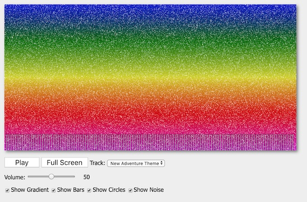

# HW - Audio Visualizer - Part III

[I. Overview](#overview)

[II. XXX](#xxx)

[XXX. Homework](#homework)

<hr><hr>

<a id="overview" />

## I. Overview

- We can grab the RGBA (red, green, blue, alpha) data for the entire canvas, manipulate it, and then copy the modified data back to the canvas
- This allows (for example) Photoshop style filters, chroma key effects, edge detection for motion and object recognition applications, and more
- The methods we’ll use here:
  - [`ctx.getImageData(x,y,width,height)`](https://developer.mozilla.org/en-US/docs/Web/API/CanvasRenderingContext2D/getImageData) - returns an [`ImageData`](https://developer.mozilla.org/en-US/docs/Web/API/ImageData) object for the specified x, y, width, height rectangle on the &lt;canvas>
  - this ImageData object has a `.data` property that is an 8-bit typed array (a ) of the rgba values of each pixel of the canvas
- [ctx.putImageData(imageData,x,y)](https://developer.mozilla.org/en-US/docs/Web/API/CanvasRenderingContext2D/putImageData) - copies an ImageData object onto the canvas at the specified x,y


<hr>

<a id="xxxx" />

## II. XXX

1)  Make a copy of the main project folder (and all of the files/folders that are in it) from Part II, and name this one **web-audio-hw-3**

<hr>

2) Here's the comments you'll need - add these to the bottom of `draw()` in **canvas.js**

```js
// 6 - bitmap manipulation
	// TODO: right now. we are looping though every pixel of the canvas (320,000 of them!), 
	// regardless of whether or not we are applying a pixel effect
	// At some point, refactor this code so that we are looping though the image data only if
	// it is necessary

	// A) grab all of the pixels on the canvas and put them in the `data` array
	// `imageData.data` is a Uint8ClampedArray(1280000) typed array that has 1.28 million elements!
	// the variable `data` below is a reference to that array 
	
	// B) Iterate through each pixel, stepping 4 elements at a time (which is the RGBA for 1 pixel)

		// C) randomly change every 20th pixel to red
	
			// data[i] is the red channel
			// data[i+1] is the green channel
			// data[i+2] is the blue channel
			// data[i+3] is the alpha channel
			// zero out the red and green and blue channels
			// make the red channel 100% red
		} // end if
	} // end for
	
	// D) copy image data back to canvas
```

<hr>

3) Now type it in the actual code yourself:


<hr>

4) When you are done, it should look something like this (I am drawing white noise so that it show's better on my red dominated background):



<hr>

<a id="homework" />

## XXX. Homework


<hr><hr>

**[Previous Chapter <- Audio Visualizer - Part II](HW-AV-2195-2.md)**
