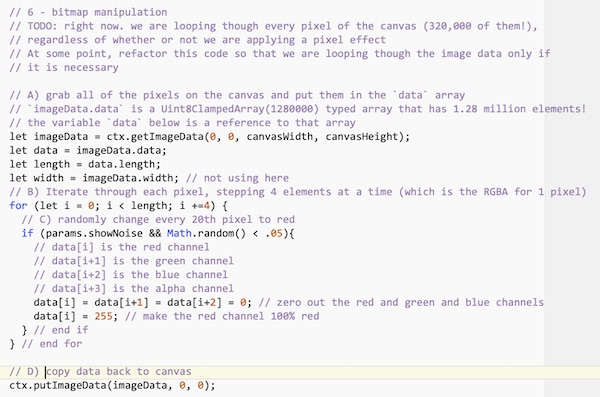
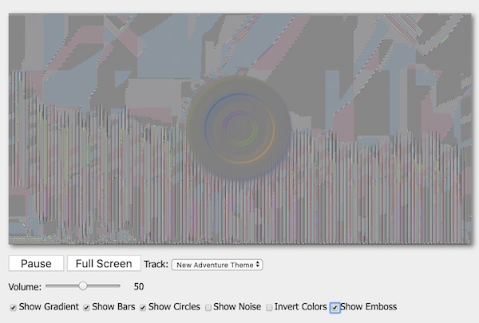
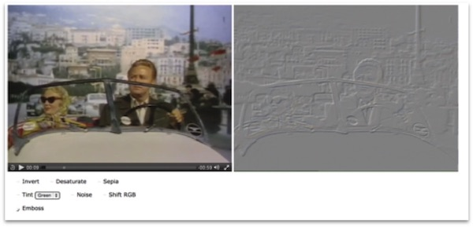
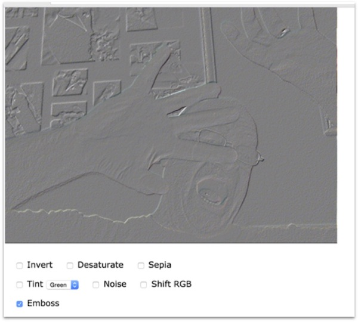

# HW - Audio Visualizer - Part III

[I. Overview](#overview)

[II. Grab some pixels](#section2)

- get the `imageData.data` from the canvas
- loop through it and create a *noise* effect

[III. More Pixel Manipulations](#section3)

- *invert* the color values of each pixel
- create an *emboss* effect

[IV. Reference](#reference)

[V. Homework](#homework)

<hr><hr>

<a id="overview" />

## I. Overview

- We can grab the RGBA (red, green, blue, alpha) data for the entire canvas, manipulate it, and then copy the modified data back to the canvas
- This allows (for example) Photoshop style filters, chroma key effects, edge detection for motion and object recognition applications, and more
- The methods we’ll use here:
  - [`ctx.getImageData(x,y,width,height)`](https://developer.mozilla.org/en-US/docs/Web/API/CanvasRenderingContext2D/getImageData) - returns an [`ImageData`](https://developer.mozilla.org/en-US/docs/Web/API/ImageData) object for the specified x, y, width, height rectangle on the &lt;canvas>
  - this `ImageData` object has a `.data` property that is an 8-bit typed array (a [`Uint8ClampedArray`](https://developer.mozilla.org/en-US/docs/Web/JavaScript/Reference/Global_Objects/Uint8ClampedArray)) of the rgba values of each pixel of the canvas
- [ctx.putImageData(imageData,x,y)](https://developer.mozilla.org/en-US/docs/Web/API/CanvasRenderingContext2D/putImageData) - copies an `ImageData` object onto the canvas at the specified x,y


<hr>

<a id="section2" />

## II. Grab some pixels

1)  Make a copy of the main project folder (and all of the files/folders that are in it) from Part II, and name this one **web-audio-hw-3**

<hr>

2) Here's the comments you'll need - add these to the bottom of `draw()` in **canvas.js**

```js
// 6 - bitmap manipulation
	// TODO: right now. we are looping though every pixel of the canvas (320,000 of them!), 
	// regardless of whether or not we are applying a pixel effect
	// At some point, refactor this code so that we are looping though the image data only if
	// it is necessary

	// A) grab all of the pixels on the canvas and put them in the `data` array
	// `imageData.data` is a `Uint8ClampedArray()` typed array that has 1.28 million elements!
	// the variable `data` below is a reference to that array 
	
	// B) Iterate through each pixel, stepping 4 elements at a time (which is the RGBA for 1 pixel)

		// C) randomly change every 20th pixel to red
	
			// data[i] is the red channel
			// data[i+1] is the green channel
			// data[i+2] is the blue channel
			// data[i+3] is the alpha channel
			// zero out the red and green and blue channels
			// make the red channel 100% red
		} // end if
	} // end for
	
	// D) copy image data back to canvas
```

<hr>

3) Now type in the actual code yourself (there's not that much, is there?):



<hr>

4) When you are done, it should look something like this (I am drawing white noise so that it shows better on my red dominated background):


<hr>

5) - **YOU DO:** Go ahead and write the code to get the "Show Noise" checkbox working. When the app loads, the checkbox for this effect should be *unchecked*


<a id="section3" />

## III. More pixel manipulations

1) Here's a manipulation where we *invert* the values of the color channels:


- put this code into your "image data loop" and be sure to only perform this manipulation when `params.showInvert` is true
- **YOU DO:** create a checkbox to toggle this effect on and off. When the app loads, the checkbox for this effect should be *unchecked*


<hr>

2) Here's a manipulation where we create an *emboss* effect:


- put this code \*\***outside of**\*\* your "image data loop" and be sure to only perform this manipulation when `params.showEmboss` is true
- And here’s a good explanation of how this emboss effect (convolution) is accomplished:
  - source: http://html5doctor.com/video-canvas-magic/
    - Then I just loop through the pixels, like I did before
    - If the pixel happens to be for the alpha channel (every fourth number in the array), I can just skip it — I don’t want to change the transparency
    - Otherwise, I’ll do a little math to find the difference between the current pixel’s color channel and the similar channels of the pixels below and to the right, then just combine that difference with the “average” gray value of 127
    - This has the effect of making areas where the pixels are the same color a flat medium gray, but edges where the color suddenly changes will turn either bright or dark

- **YOU DO:** create a checkbox to toggle this effect on and off. When the app loads, the checkbox for this effect should be *unchecked*



- The emboss effect above looks a little strange with the procedurally generated graphics we are using here. Here are some other emboss examples - on bitmapped images - that give a more typical effect - these might get demoed in class:





<hr>


<a id="section4" />

## IV. Reference (Image Processing Links)

- Image processing is a large field of study - here are some links you might find handy:
  - http://www.techrepublic.com/blog/how-do-i/how-do-i-convert-images-to-grayscale-and-sepia-tone-using-c/#
  - http://stackoverflow.com/questions/1061093/how-is-a-sepia-tone-created
  - http://html5doctor.com/video-canvas-magic/
  - https://archive.org/details/Lectures_on_Image_Processing
  - http://stackoverflow.com/questions/13932855/canvas-flip-half-the-image
  - http://www.html5rocks.com/en/tutorials/canvas/imagefilters/#toc-setup
  - http://lodev.org/cgtutor/filtering.html

- Another application of this (when combined with the webcam) is edge detection, which lets us detect, recognize and track objects and motion, which leads to making a webcam controller that acts like the Kinect. There are JS libraries available that can do this:
  - https://github.com/mtschirs/js-objectdetect
  - http://trackingjs.com/docs.html

<hr>

<a id="homework" />

## V. Homework

- Rubric (out of 10 points):
  - (4 points) everything through to the end of Part II works
  - (1 point) "Show Noise" checkbox works
  - (1 point) change the red noise to a different color
  - (2 points) "Invert" effect & checkbox works
  - (2 points) "Emboss" effect & checkbox works
  

<hr><hr>

**[Previous Chapter <- Audio Visualizer - Part II](HW-AV-2195-2.md)**
