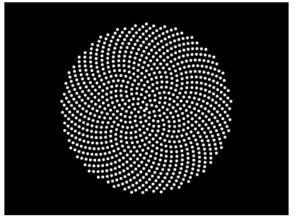
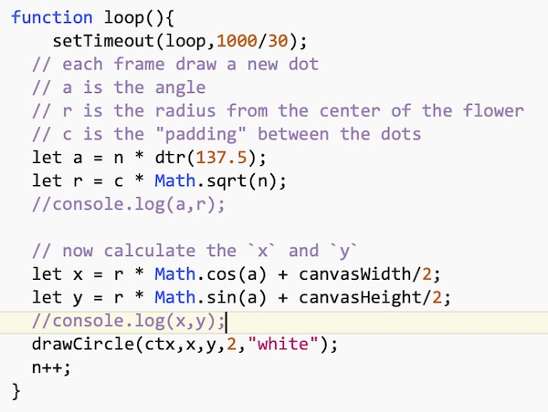

# HW - Algorithmic Botany


## I. Overview

 - Today we'll
 - In botany, phyllotaxy is the arrangement of leaves on a plant stem - these spirals form a distinctive class of patterns in nature.
 
 Links:
 - Coding Train [Coding Challenge #30: Phyllotaxis](https://thecodingtrain.com/CodingChallenges/030-phyllotaxis.html)
 - https://en.wikipedia.org/wiki/Phyllotaxis
 - http://www.algorithmicbotany.org
 - http://www.algorithmicbotany.org/papers/abop/abop-ch4.pdf
 
 
## II. Instructions

- Watch the video
- Grab the start file

1. Add your `window.onload = init;` call to the right place.

2. Create a "script scoped" variable named `n` that keeps track of the number of dots (petals) as we draw them. "script scoped" means that it is declared at the "top level" outside of any functions.

`let n = 0;`

3. Also go ahead and declare the "divergence angle" in "script scope":

`const divergence = 137.5;`

4. Now create a `loop()` function that looks like this, and call it from the end of the `init()` function:

```js
function loop(){
 	setTimeout(loop,1000/30);
  
  
  n++;
}
```

5. Each frame we need to draw a new dot (pedal) by calulating its polar coordinates (a distance from the center - `r` below, and an angle `a` below). Add the following to the top of `loop()` - after the call to `setTimeout()`:

```js
// each frame draw a new dot
// `a` is the angle
// `r` is the radius from the center of the flower
// `c` is the "padding" between the dots
let a = n * dtr(137.5);
let r = c * Math.sqrt(n);
console.log(a,r);
```

6. `c` is a "script scoped" variable - go declare and initialize it now:

`const c = 4;`

7. Run this in the browser, and check the console to be sure you're getting the angle (in radians) and radius logged out. You should be seeing numbers something like this:

```
0 0
2.399827721492203 4
4.799655442984406 5.656854249492381
7.199483164476609 6.928203230275509
9.599310885968812 8
```

- Comment out the `console.log()` when you are finished

8. Now let's calculate the `x` and `y`. To draw everything relative to the center of the window we will add half the width and height of the window to the `x` and `y`. Go ahead and add the following to `loop()`:

```js
// now calculate the `x` and `y`
let x = r * Math.cos(a) + canvasWidth/2;
let y = r * Math.sin(a) + canvasHeight/2;
console.log(x,y);
```


9. Run this in the browser, and check the console to be sure you're getting the `x` and `y` logged out. You should be seeing numbers something like this (comment out the `console.log()` when you are done):

```
200 150
197.0508906527595 152.70236083046265
200.49302733372974 144.36467178877794
204.21762289892536 155.4965131749556
192.12153797590233 148.61081457866456
```

10. We've done enough so that we can now draw the dots by calling our helper function - here it is:

```js
drawCircle(ctx,x,y,2,"white");
```

11. Run the app. You should see something like this.




12. If your code isn't co-operating, compare your `loop()` to this version.


