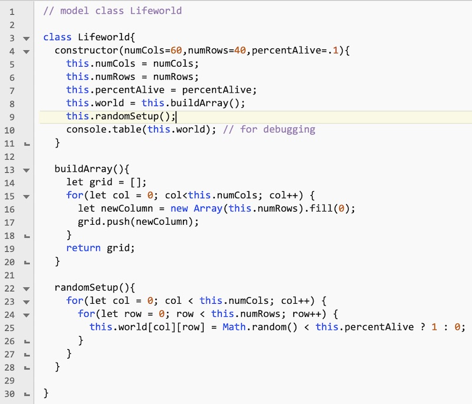
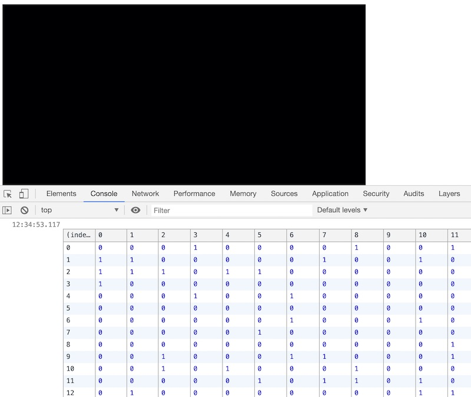
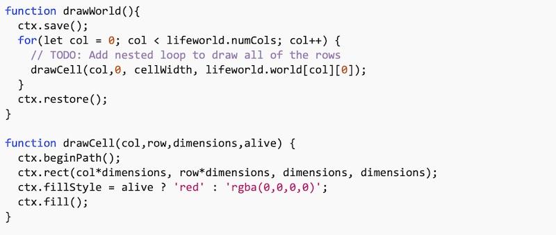
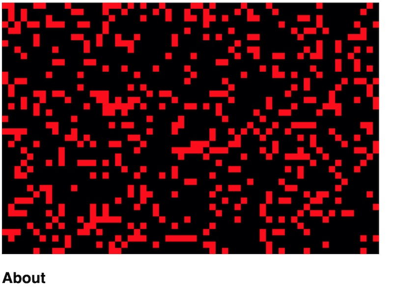

# Conway's Game of Life (now in Canvas!)

## I. Overview
- Some info about *Conway's Game of Life* and cellular automata is below: 
  - https://en.wikipedia.org/wiki/Conway%27s_Game_of_Life
  - https://en.wikipedia.org/wiki/Cellular_automaton


***Here is a GIF of the Life "Glider Gun" pattern:***


- Here are the rules to Life:
  - Any live cell with fewer than two live neighbours dies, as if caused by underpopulation.
  - Any live cell with two or three live neighbours lives on to the next generation.
  - Any live cell with more than three live neighbours dies, as if by overpopulation.
  - Any dead cell with exactly three live neighbours becomes a live cell, as if by reproduction.

## II. Completed Version


## III. Start Files

**life-HW-start.html**

```html
<!DOCTYPE html>
<html lang="en">
<head>
	<meta charset="utf-8" />
	<title></title>
	<style>
		body{
			font-family: sans-serif;
		}
		canvas{
			background-color: #0000AD;
		}
	</style>
	<script src="src/Lifeworld.js"></script>
	<script src="src/main.js"></script>
</head>
<body>
	<canvas></canvas>
	
	<h2>About</h2>
	<ul>
	<li><a href="http://www.ibiblio.org/lifepatterns/october1970.html"><i>MATHEMATICAL GAMES - The fantastic combinations of John Conway's new solitaire game "life"</i></a> by Martin Gardner</li>
	<li><a href="https://en.wikipedia.org/wiki/Conway%27s_Game_of_Life">Wikipedia entry about Conway's Game of Life</a></li>
	<li><a href="https://en.wikipedia.org/wiki/Oscillator_(cellular_automaton)">https://en.wikipedia.org/wiki/Oscillator_(cellular_automaton)</a></li>
	<li><a href="https://conwaylife.com/forums/viewtopic.php?f=7&t=20">https://conwaylife.com/forums/viewtopic.php?f=7&t=20</a></li>
	</ul>
	
</body>
</html>
```

**main.js**

```js
let canvas, ctx;
const canvasWidth = 600, canvasHeight = 400;
const cellWidth = 10;
const fps = 12;
let lifeworld;

window.onload = init;

function init(){
	canvas = document.querySelector("canvas");
	canvas.width = canvasWidth;
	canvas.height = canvasHeight;
	ctx = canvas.getContext("2d");
	// TODO: init lifeworld
	loop();
}

function loop(){
	setTimeout(loop,1000/fps);
	// TODO: update lifeworld
	drawBackground();
	drawWorld();
}

function drawBackground(){
	ctx.save();
	ctx.fillStyle = "black";
	ctx.globalAlpha = 4/fps;
	ctx.fillRect(0,0,canvasWidth,canvasHeight);
	ctx.restore();
}

function drawWorld(){
	// TODO: implement
}

function drawCell(col,row,dimensions,alive) {
	// TODO: implement
}
```

**Lifeworld.js**

```js
// model class Lifeworld
// TODO: Write code
```


## IV. Instructions

- The overall app structure is:
  - **life-HW.html** will contain the HTML/CSS and HTML elements
  - **Lifeworld.js** will contain all of the JS *code/logic* for the Life sim - ex. setting up the 2D arrays, counting up all of the neighbors for each cell to determine if they are dead or alive, loading patterns and so on
  - **main.js** will contain all of the JS code for *drawing* the Life sim into the canvas element. It will also be responsible for the UI (Play, Pause, Restart Sim etc)

<hr>

1) Go ahead and create all of the above files and then preview them in a web browser. You should see a black 600 x 400 rectangle in the browser window.

<hr>

2) Add the following to **Lifeworld.js**:



- above, we can see that a 2D array has been created, and that there is code to loop though this array and randomly place 0's and 1's in it. 

<hr>

3) In **main.js**, add the following to `init()`

`lifeworld = new Lifeworld(60,40,.2);`

<hr>

4) Test the code, and check the console. You should see the 2D array we are using has been created and populated with random 0's and 1's. 



<hr>

5) We have now completed the foundational code for Lifeworld - so let's head over to **main.js** and work on visualizing this array in the canvas. Go ahead and add update the `drawWorld()` and `drawCell()` functions in **main.js**:



- Which will look like this when you run the code:


<hr>

6) Note that we're only drawing the top row. You will need to finish off the nested loop so that the whole 2D array get's drawn. When you are done it loks like this:



<hr>

7)
