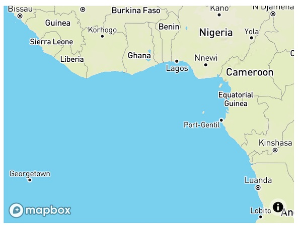
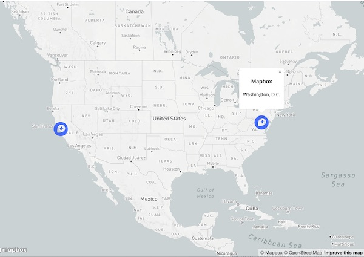
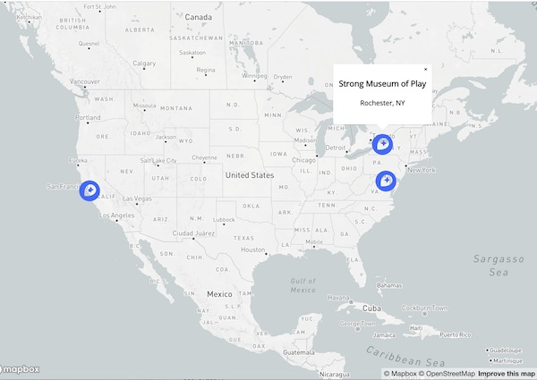

# Mapbox Intro


- An alternative to google maps is Mapbox - let's check it out.


## I. Get Started

1. Sign up for an account here: https://account.mapbox.com/auth/signup/
2. On the account page - https://account.mapbox.com
3. Click the "Start by designing a map" button:
    - Choose "JS Web"
    - Choose "Use the Mapbox CDN"
    - Create an empty HTML page named **mapbox-start.html**
    - Follow the instructions and add the `<link>`and `<script>` tags, as well as the JS and HTML, to the page
    - Note that you will be given your Mapbox access token - keep a copy of it somewhere


**Here's what the HTML page will look like - you'll need to add your *access token* to it:**

**mapbox-start.html**

```html
<!DOCTYPE html>
<html lang="en">
<head>
	<meta charset="utf-8" />
	<title>Map Start</title>
	<script src='https://api.mapbox.com/mapbox-gl-js/v1.8.1/mapbox-gl.js'></script>
	<link href='https://api.mapbox.com/mapbox-gl-js/v1.8.1/mapbox-gl.css' rel='stylesheet' />
</head>
<body>
<div id='map' style='width: 400px; height: 300px;'></div>
<script>
	mapboxgl.accessToken = 'ACCESS-TOKEN-GOES-HERE-GO-GET-YOUR-OWN!';
	var map = new mapboxgl.Map({
	container: 'map',
	style: 'mapbox://styles/mapbox/streets-v11'
	});
</script>

</body>
</html>
```

<hr>

## I-A. Test it

Screenshot of **mapbox-start.html**:

<hr>



<hr>

## I-B. Some things to try

1) Change the `center` and `zoom` of the map to the Rochester area:

```js
map.setZoom(9);
map.setCenter([-77.6799,43.083848]); // note the order - it's longitude,latitude - which is opposite of Google Maps
```

2) Go to this landing page --> https://www.mapbox.com/install/js/cdn-complete/
    - Now navigate to the [Add controls](https://docs.mapbox.com/mapbox-gl-js/example/navigation/) page to add a visible controller to your map (it's one line of code)

3) Head back to the landing page
    - Now navigate to [Style Animation](https://docs.mapbox.com/mapbox-gl-js/example/setstyle/) page:
    - You don't need to set up the radio buttons, but go ahead and change you map's style from  `streets-v11` to: 
      - `light-v10` OR
      - `dark-v10` OR
      - `outdoors-v11` OR
      - `satellite-v9`
    - You can also write code to change the style like this: `map.setStyle('mapbox://styles/mapbox/satellite-v9');`
  
4) ZIP and POST the **mapbox-start.html** file to the dropbox

<hr>

## II. Create a map with clickable markers

1) Create a folder named **custom-marker**
2) Inside of the **custom-marker** folder, create an empty file named **index.html**
3) Follow the "Add custom markers in Mapbox GL JS" tutorial here: https://docs.mapbox.com/help/tutorials/custom-markers-gl-js/
    - Don’t neglect to download the provide **mapbox-icon.png** file
    - Read through the tutorial, just don’t copy/paste!
4) When you are done, it looks like this:

<hr>



<hr>

5) Let’s think about adding a marker - and to do that, we need to add in some "place data". The `geojson` object in the code is using a format called - you guessed it - GeoJSON. MapBox expects that "point of interest" type data is encoded this way. Note the `features` array is an array of object literals that contains `coordinate`, `title`, and `description` information.

6) Here’s some info about the GeoJSON format: 
    - https://geojson.org
    - http://geojson.io/ - a GeoJSON "builder" - one thing you can do is to drop markers on the map and this will write the GeoJSON for you 

7) So, go ahead and add another object literal to the `features` array:
    - you’ll need `coordinate`, `title`, and `description` information
    - in the example screenshot below, I added info for the Strong Museum of Play
    - where can you get coordinate information? One place would be to try the tool at http://geojson.io/ 


<hr>



<hr>


