# Mapbox-2 - *RIT Coffee Finder*

***For all of the steps going forward, keep the debugger console open to be sure that you don’t have any errors***

***This exercise could be a nice "starter" for Project 3!***

## I. Get Started

1) Duplicate the **custom-marker** folder and name the copy **rit-coffee-finder**

2) Download this icon (right-click and save) and put it into the **rit-coffee-finder/images** folder --> 

3) Modify your CSS to use the new icon, and change the `width` and `height` to 30px

4) In **src/main.js**, delete the contents of the `features` array (inside the `geojson` object) - it should look like this:

```js
let geojson = {
  type: 'FeatureCollection',
  features: []
};
```
    
5) Now move the `let geojson = {…};` code OUTSIDE of the `init()` method. Reload the page - the markers should be gone.
    

6) Change the `center` and `zoom` properties of the map to zoom in on RIT - `[-77.6799,43.083848]` and `14`

    - Reload the page - the map should be zoomed in on RIT

7) Now create a function named `initMap()`:

    - move the `mapboxgl.accessToken = …` and `const map = new mapboxgl.Map({…});` code into it
    - ***IMPORTANT -->*** you’ll need to declare `map` at the top of **main.js** now, with a `let` declaration

8) Now call `initMap()` from the top of `init()`

    - Test your code in the browser, it should work the same

9) Now create a new function named `addMarkersToMap()` and move the marker creation code into it

10) In `init()`,  call `addMarkersToMap()` right after you call `initMap()`

    - Test your code in the browser, it should work the same

11) This is what **src/main.js** should look like (I’ve folded some code, obviously):

<hr>

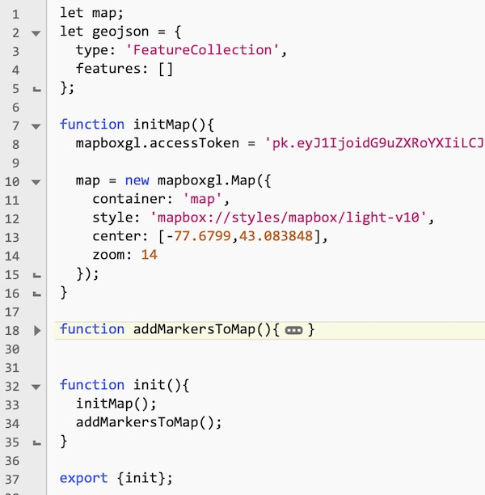

<hr><hr>

## II. Add some markers

- Now that we've done some refactoring, it will be easy to load in some location data (RIT Coffeeshop locations and names)

1) In **src/main.js**, let’s create a new function named `loadMarkers()` - it will look like this - thank goodness for copy/paste - eh?:

```js
function loadMarkers(){
  const coffeeShops = [
        {
		latitude:43.084156,
		longitude:-77.67514,
		title:"Artesano Bakery & Cafe"
	},

	{
		latitude:43.083866,
		longitude:-77.66901,
		title:"Beanz"
	},

	{
		latitude:43.082520,
		longitude:-77.67980,
		title:"Midnight Oil"
	},

	{
		latitude:43.086678,
		longitude:-77.669014,
		title:"The College Grind"
	},

	{
		latitude:43.082634,
		longitude:-77.68004,
		title:"The Cafe & Market at Crossroads"
	},

	{
		latitude:43.08382,
		longitude:-77.674805,
		title:"RITZ Sports Zone"
	},

	{
		latitude:43.086502,
		longitude:-77.66912,
		title:"The Commons"
	},

	{
		latitude:43.08324,
		longitude:-77.68105,
		title:"The Market at Global Village"
	},

	{
		latitude:43.08384,
		longitude:-77.67457,
		title:"Brick City Cafe"
	},

	{
		latitude:43.084904,
		longitude:-77.6676,
		title:"Corner Store"
	},

	{
		latitude:43.08464,
		longitude:-77.680145,
		title:"CTRL ALT DELi"
	},

	{
		latitude:43.08359,
		longitude:-77.66921,
		title:"Gracie's"
	}
];
	
	// now convert this data to GeoJSON

}
```

<hr>

2) Here’s the rest of the code - you can type this:

<hr>

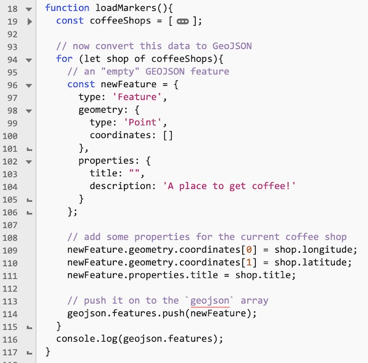

<hr>

3) Now put a call to `loadMarkers()` in the `init()` function, right between `initMap();` and `addMarkersToMap()`

4) Reload the page, you should see the markers. Check the console, you should see the `geojson` logged out:

<hr>


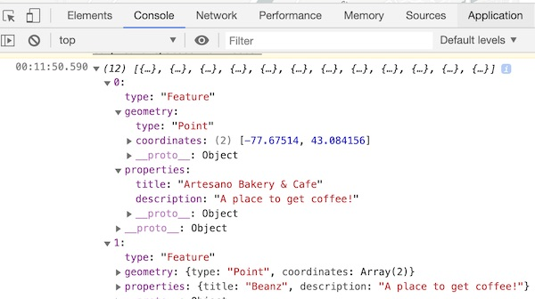

<hr><hr>

## III. Create a ***map.js*** module

- We are going to being adding a lot of "map code" soon, so let's go ahead and break out all of the map-related JS into a separate file

1) Create a **map.js** file and put it in the **src** folder

2) Move all of the map-related code from **src/main.js** to **src/map.js**

3) Add the following to the bottom of **src/map.js**

    - `export {initMap,loadMarkers,addMarkersToMap};`
    
4) Now you need to add an `import` to the top of **src/main.js** - and call the code located in **src/map.js** with the `map` namespace - **src/main.js** should now look like this:

**src/main.js**

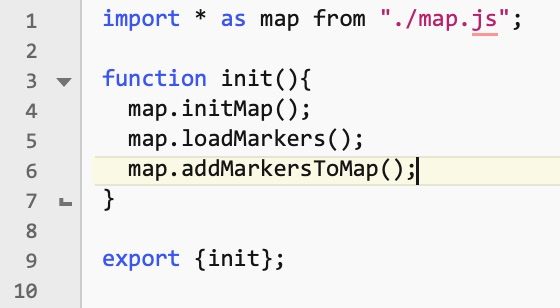

5) Reload the page, it should work as before

<hr><hr>

## IV. Add some map controls

- We are going to add controls to the screen that will let the user zoom in and out and move the center of the map

1) Here's the HTML:

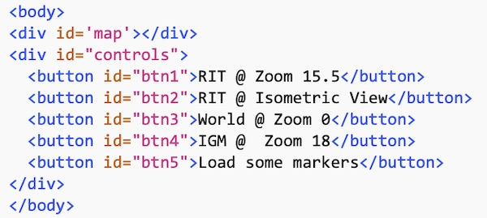

2) Here's the CSS:

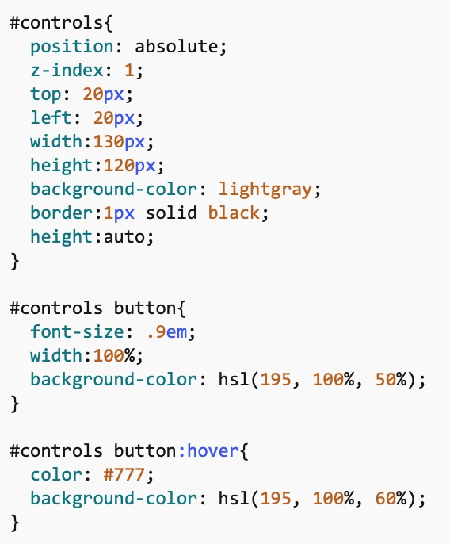

3) Reload the page, you should see this:

<hr>

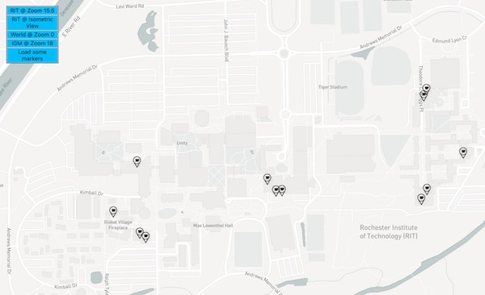

<hr>

4) Now we need to add some functions to our **map.js** module:

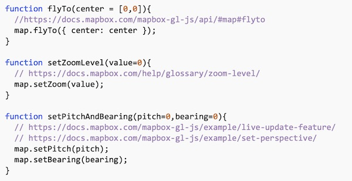

- these 3 functions control the center, zoom level, and viewing angle (perspective) of our map
- note that we have given the function parameters *default values* that will be used if no value is passed in
- see the documentation and examples here:
  - https://docs.mapbox.com/mapbox-gl-js/api/#map#flyto
  - https://docs.mapbox.com/help/glossary/zoom-level/
  - https://docs.mapbox.com/mapbox-gl-js/example/live-update-feature/
  - https://docs.mapbox.com/mapbox-gl-js/example/set-perspective/
- be sure to export these three functions, or you won't be able to use them outside of **map.js**!

5) Now we need to write some code in **main.js** that can call these functions when the buttons are clicked on. Here's the first part for your copy/paste pleasure:

```js
function setupUI(){
  // it's easy to get [longitude,latitude] coordinates with this tool: http://geojson.io/
  const lnglatRIT = [-77.67454147338866, 43.08484339838443];
  const lnglatIGM = [-77.67990589141846, 43.08447511795301];
}
```

- Don't forget to call `setupUI()` from the bottom of `main.init()` !
- Here's the rest of `setupUI()` for you to type in:

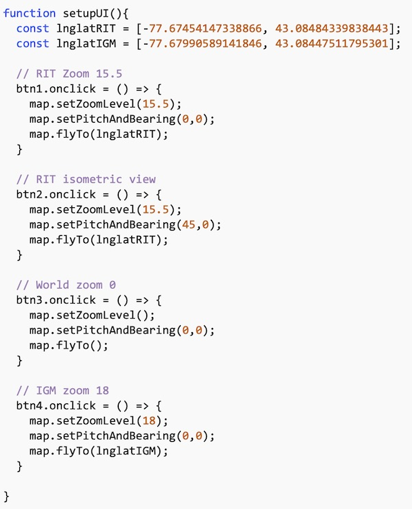


6) Reload the page - and test out the first 4 buttons - here's what the "RIT @ Isometric View" looks like:

<hr>

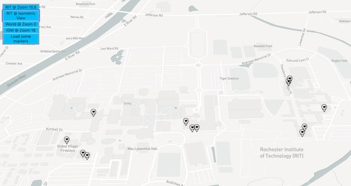

<hr><hr>


## V. Add a map layer

1) Now let's add a map layer - https://docs.mapbox.com/mapbox-gl-js/style-spec/layers/
    - Here we'll add a `paint` layer of type `fill-extrusion` to the map that will allow Mapbox to draw buildings in 3D
    - The code to do this is straight out of a Mapbox example:
      - the example is here: https://docs.mapbox.com/mapbox-gl-js/example/3d-buildings/
      - this is a simple copy/paste - you will need to copy ALL of the code in the "map onload call":
        - beginning here: `map.on('load', function() {`
        - and ending here: `});`
    - put this code at the bottom of `init()` in the **maps.js** module - when you paste it all of the formatting will be gone, so try to indent and pretty it up and some point


2) Reload the page to see the difference - below I am in the "RIT @ Isometric View", and slightly zoomed in - note that the extruded buildings give a nice 3D effect:

<hr>

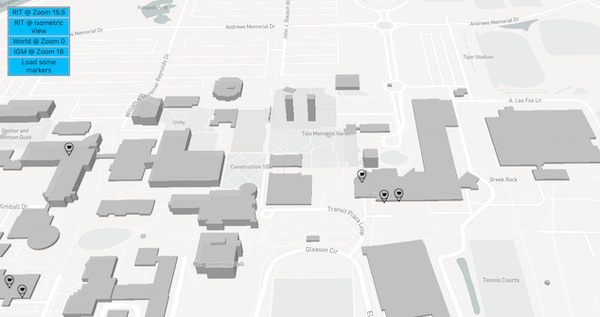

<hr><hr>

## VI. Load some external data via Ajax

- Let's walk through how easy it is load new data from the Internet and then display it on the map

1) 

<hr><hr>
