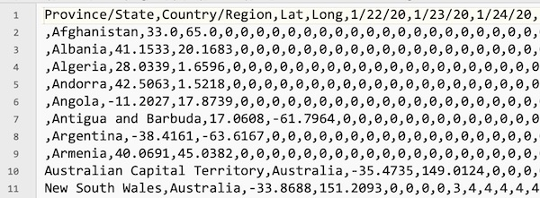
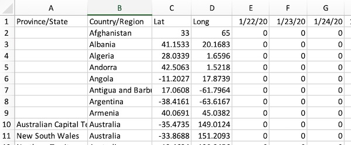
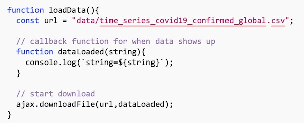

# Mapbox-3 - *Virus Map*

***This is an optional extra credit assignment***

***Spreadsheet data (substantial, and from a public source) could be a possible "2nd API" for Project 2 - but check with your Professor, in advance!***

## I. Get Started

1) Duplicate the **custom-marker** folder and name it **virus-map** 

2) Load it into a web browser to be sure that **index.html** still works. Recall that because this used ES6 modules, you need to run this off of a web server to get it to work. 

3) Download this icon (right-click and save) and put it into the **virus-map/images** folder -->  

4) In **src/main.js**, delete the contents of the `features` array (inside the `geojson` object) - it should look like this:

```js
let geojson = {
  type: 'FeatureCollection',
  features: []
};
```

5) Now move the `let geojson = {…};` code OUTSIDE of the `init()` method. Reload the page - the markers should be gone.

6) Now create a function named `initMap()`:
    - move the `mapboxgl.accessToken = …` and `const map = new mapboxgl.Map({…});` code into it
    - IMPORTANT --> you’ll need to declare `map` at the top of **main.js** now, with a `let` declaration

7) Delete the marker creation code from the bottom of `init()`

8) Now call `initMap()` from the top of `init()`

9) Test your code and be sure that the map appears and there are no errors in the console. Your code should look like this:


<hr><hr>

## II. Obtain the CSV data

1) In **virus-map**, create a folder named **data**

2) Head to this web page - https://data.humdata.org/dataset/novel-coronavirus-2019-ncov-cases - and download the "time_series_covid19_confirmed_global.csv" spreadsheet, and put it in the **data** folder

3) Open this file up in a text editor - BTW **.csv** stands for "comma separated values"

<hr>



<hr>

4) Unlike HTML & XML, the data lacks *semantics* and not is not tagged in any way, other than the fact that the first row of the CSV file gives us the "title" each column
    - each row (except the first) represents a ***record*** of each country’s Coronavirus cases. 
    - each comma separated value is a ***field*** of that record, and will be represented as a **column** when it is loaded into a spreadsheet (see below)
    - the first row of the spreadsheet represents the ***titles*** of these fields
    - the first 4 values in the first row tell us that the first 4 columns represent the:
      - "Province or State"
      - "Country or Region"
      - "Latitude"
      - "Longitude"
    - The 5th column and onward represent dates
    - The values of each column represent the number of COVID-19 cases that were diagnosed for that country on a particular date. 
    - For example, the New South Wales territory of Australia had zero diagnosed cases as of 1/22/20, and had 3 cases on 1/26/20

5) You might find the data easier to read when it is formatted as a spreadsheet. Below we have opened up the same file in Excel:

<hr>



<hr>

6) Inspecting and "Cleaning" our data

    - Note above how although it’s the same data, it is now nicely laid out in rows and columns.
    - If we scroll down spreadsheet and look at all the data, we can get a sense of its structure, and if there are any missing or odd values:
      - note that the "Province/State" field is blank for most of the entries - for example, the "US" data (row 227) is for the entire country, and no "Province/State" value is given. Contrast this with the "United Kingdom" values (rows 219-225) where 6 of the 7 rows have values for "Province/State" 
      - so the "Province/State" field is the only one with missing values, the other fields always have a value
      - later on when we write our JS code to load and parse this spreadsheet, we’ll need to keep these missing values in mind
    - Now let’s look over the "raw" data again by heading back to the text editor:
      - scroll down the line #145 (`,"Korea, South", …`):
        - note that there is a comma contained in the quotes, and that the same line in the Excel spreadsheet is missing (not displaying) the quotes
        - line #258 has the same issue
      - This extra comma contained in the quotes will cause problems later when we use JS to load and parse the spreadsheet
      - To fix this issue, we COULD edit the CSV file to get rid of these extra commas (which is "cleaning" your data
      - But because this CSV data is getting updated every day that would mean that we would have to "clean" the file every day when we downloaded a new spreadsheet
      - So what we will do instead is to make sure that our loading/parsing JavaScript can handle the "empty field" and "extra commas in quotes" issues

<hr>

## III. Load the CSV file

  - Now let's load in the CSV data

1) Go ahead and make a copy of **rit-coffee-finder/src/ajax.js**  and put it into **virus-map/src**

2) In **ajax.js**, comment out both of the `console.log()` calls

3) At the top of **main.js** go ahead and `import` **ajax.js**: `import * as ajax from "./ajax.js”;`

4) In **main.js** , create a `loadData()` function - it looks like this:





5) Now call `loadData()` from the bottom of `init()`

6) Reload the page, you should see the contents of the CSV file printed to the console

<hr>

## IV. Create a model class

1) Now we are going to create an ES6 class - **Region** - to help organize and validate our data:
    - our first attempt looks like this ...
    - and it's going to go in a new file named **classes.js** in the **src** folder ...
    - recall that the first 4 fields of each row are the name of the region and its `latitude` and `longitude`, and the rest of the elements in each row is going to be a [time series](https://en.wikipedia.org/wiki/Time_series) - which is a sequence of data points in chronological order:


2) Don't forget to `import` the **classes.js** module at the top of **main.js**

<hr>

## V. Parse the CSV file

1) Here's our first version of the function that’s going to parse the loaded CSV file - `parseData()`:
