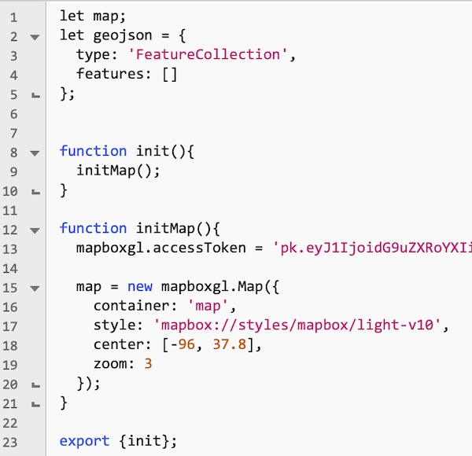
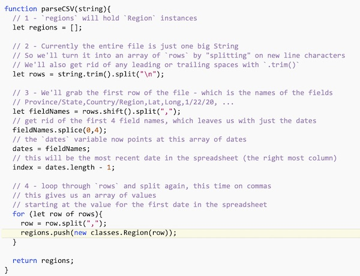
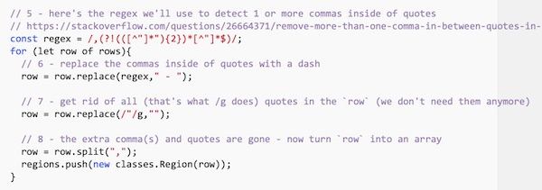
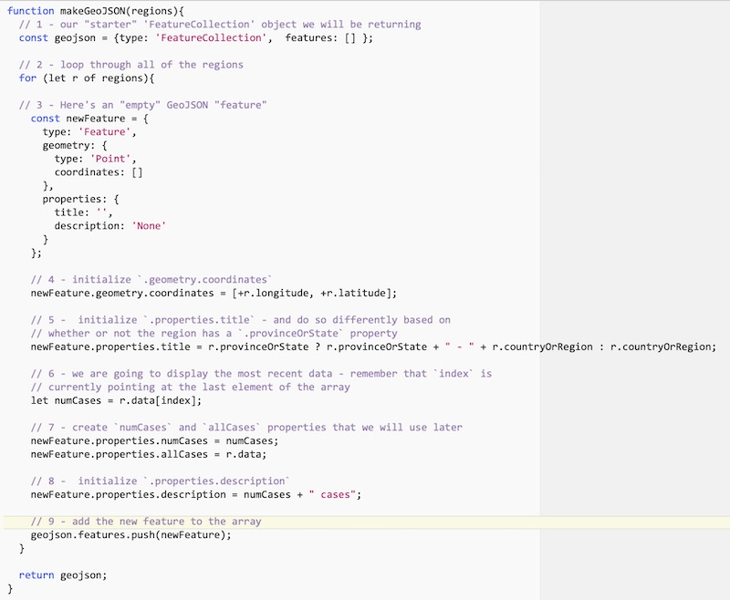
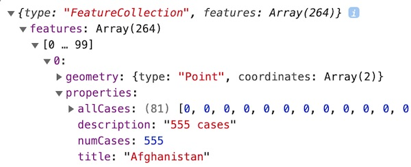
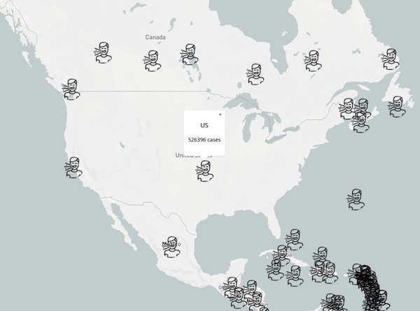
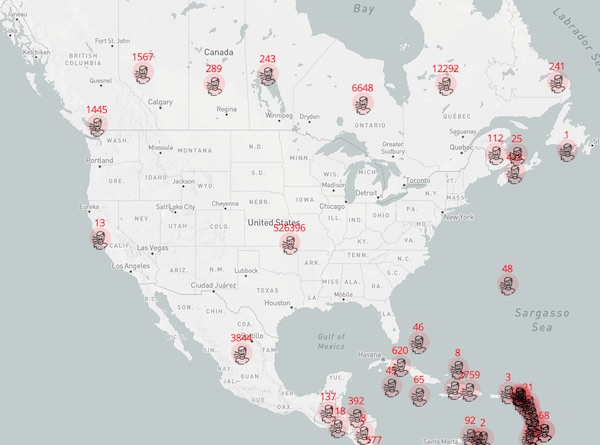

# Mapbox-3 - *Virus Map*

***This is an optional extra credit assignment***

***Spreadsheet data (substantial, and from a public source) could be a possible "2nd API" for Project 2 - but check with your Professor, in advance!***

## I. Get Started

1) Duplicate the **custom-marker** folder and name it **virus-map** 

2) Load it into a web browser to be sure that **index.html** still works. Recall that because this used ES6 modules, you need to run this off of a web server to get it to work. 

3) Download this icon (right-click and save) and put it into the **virus-map/images** folder -->  
    - make sure that the CSS has this icon sized at 30px x 30px

4) In **src/main.js**, delete the contents of the `features` array (inside the `geojson` object) - it should look like this:

```js
let geojson = {
  type: 'FeatureCollection',
  features: []
};
```

5) Now move the `let geojson = {…};` code OUTSIDE of the `init()` method. Reload the page - the markers should be gone.

6) Now create a function named `initMap()`:
    - move the `mapboxgl.accessToken = …` and `const map = new mapboxgl.Map({…});` code into it
    - IMPORTANT --> you’ll need to declare `map` at the top of **main.js** now, with a `let` declaration

7) Delete the marker creation code from the bottom of `init()`

8) Now call `initMap()` from the top of `init()`

9) Test your code and be sure that the map appears and there are no errors in the console. Your code should look like this:



<hr><hr>

## II. Obtain the CSV data

1) In **virus-map**, create a folder named **data**

2) Head to this web page - https://data.humdata.org/dataset/novel-coronavirus-2019-ncov-cases - and download the "time_series_covid19_confirmed_global.csv" spreadsheet, and put it in the **data** folder

3) Open this file up in a text editor - BTW **.csv** stands for "comma separated values"

<hr>


<hr>

4) Unlike HTML & XML, the data lacks *semantics* and is not tagged in any way, other than the fact that the first row of the CSV file gives us the "title" for each column
    - each row (except the first) represents a ***record*** of each country’s Coronavirus cases. 
    - each comma separated value is a ***field*** of that record, and will be represented as a **column** when it is loaded into a spreadsheet (see below)
    - the first row of the spreadsheet represents the ***titles*** of these fields
    - the first 4 values in the first row tell us that the first 4 columns represent the:
      - "Province or State"
      - "Country or Region"
      - "Latitude"
      - "Longitude"
    - The 5th column and onward represent dates
    - The values of each column represent the number of COVID-19 cases that were diagnosed for that country on a particular date. 
    - For example, the New South Wales territory of Australia had zero diagnosed cases as of 1/22/20, and had 3 cases on 1/26/20

5) You might find the data easier to read when it is formatted as a spreadsheet. Below we have opened up the same file in Excel:

<hr>


<hr>

6) Inspecting and "Cleaning" our data

    - Note above how although it’s the same data, it is now nicely laid out in rows and columns.
    - If we scroll down the spreadsheet and look at all the data, we can get a sense of its structure, and if there are any missing or odd values:
      - note that the "Province/State" field is blank for most of the entries - for example, the "US" data (row 227) is for the entire country, and no "Province/State" value is given. Contrast this with the "United Kingdom" values (rows 219-225) where 6 of the 7 rows have values for "Province/State" 
      - so the "Province/State" field is the only one with missing values, the other fields always have a value
      - later on when we write our JS code to load and parse this spreadsheet, we’ll need to keep these missing values in mind
    - Now let’s look over the "raw" data again by heading back to the text editor:
      - scroll down the line #145 (`,"Korea, South", …`):
        - note that there is a comma contained in the quotes, and that the same line in the Excel spreadsheet is missing (not displaying) the quotes
        - line #258 has the same issue
      - This extra comma contained in the quotes will cause problems later when we use JS to load and parse the spreadsheet
      - To fix this issue, we COULD edit the CSV file to get rid of these extra commas (which is "cleaning" your data
      - But because this CSV data is getting updated every day that would mean that we would have to "clean" the file every day when we downloaded a new spreadsheet
      - So what we will do instead is to make sure that our loading/parsing JavaScript can handle the "empty field" and "extra commas in quotes" issues

<hr>

## III. Load the CSV file

  - Now let's load in the CSV data

1) Go ahead and make a copy of **rit-coffee-finder/src/ajax.js**  and put it into **virus-map/src**

2) In **ajax.js**, comment out both of the `console.log()` calls

3) At the top of **main.js** go ahead and `import` **ajax.js**: `import * as ajax from "./ajax.js”;`

4) In **main.js** , create a `loadData()` function - it looks like this:


5) Now call `loadData()` from the bottom of `init()`

6) Reload the page, you should see the contents of the CSV file printed to the console

<hr>

## IV. Create a model class

1) Now we are going to create an ES6 class - **Region** - to help organize and validate our data:
    - our first attempt looks like this ...
    - and it's going to go in a new file named **classes.js** in the **src** folder ...
    - recall that the first 4 fields of each row are the name of the region and its `latitude` and `longitude`, and the rest of the elements in each row is going to be a [time series](https://en.wikipedia.org/wiki/Time_series) - which is a sequence of data points in chronological order:


2) Don't forget to `export {Region};` at the *bottom* of **classes.js**

3) Don't forget to `import` the **classes.js** module at the *top* of **main.js**

<hr>

## V. Parse the CSV file

1) Here's our first version of the function that’s going to parse the loaded CSV file - `parseCSV()` - note the `String` and `Array` methods we are using:



- you will also need to declare the `dates` and `index` variables "up top" (next to `map`) e.g. *module scope*
- Reference:
  - https://developer.mozilla.org/en-US/docs/Web/JavaScript/Reference/Global_Objects/String/split
  - https://developer.mozilla.org/en-US/docs/Web/JavaScript/Reference/Global_Objects/String/trim
  - https://developer.mozilla.org/en-US/docs/Web/JavaScript/Reference/Global_Objects/Array/shift
  - https://developer.mozilla.org/en-US/docs/Web/JavaScript/Reference/Global_Objects/Array/splice

<hr>

2) Modify `dataLoaded()` to look like this so that is parses the CSV:

```js
// callback function for when data shows up
function dataLoaded(string){
  //console.log(`string=${string}`);
  let regions = parseCSV(string);
  console.log(regions);
}
```

<hr>

3) Reload the page and check the console to see the values of the properties of the `Region` instances - things look pretty good here (with ONE exception, the values in the `data` array are of data type `String`, not `Number` like we might need them to be:

<hr>


<hr>

- and here I put in a breakpoint to check the values of `index` and `dates` - note that `dates` has a length of `81` and `index` has a value of `80` (which is the last element in the array):

<hr>


<hr>

4) But when you scroll down to element 143 (where we had the extra comma contained in the quotes) there are issues: 

    - `.countryOrRegion` has an extra quote, that can't be good
    - the `data` array's first value is wrong
    - the `latitude` value is wrong
    - this is because of the "extra comma" problem!
    - but we can solve this - the reason that the extra comma only appears when contained in quotes, is so that it is easier for us to write code to ignore commas that appear within quotes

<hr>


<hr>

5) Here's the fix - with an assist from SO - see the code below:
   
    - And here is the regex for your copy/paste pleasure
    - Reference:
      - https://developer.mozilla.org/en-US/docs/Web/JavaScript/Reference/Global_Objects/String/replace
      - https://regex101.com
    
```js
// https://stackoverflow.com/questions/26664371/remove-more-than-one-comma-in-between-quotes-in-csv-file-using-regex?rq=1
const regex = /,(?!(([^"]*"){2})*[^"]*$)/;
```
    


<hr>
 
 6) Reload the page and check the log, you should see the issues are fixed:
     - although there is one small issue with `.countryOrRegion` - an extra space after the dash. The marker HTML will hide this - because web browsers will ignore extra space characters after the first one - so we're going to be lazy and let it ride - but go ahead and fix that later on if you want to ...
     
     
<hr>


<hr>

<hr>


## VI. Revisit the `Region` class

1) Let's be like the "cool kids" and make some modifications to our `Region` class:

    - We'll use the *array destructuring assignment* and *rest parameters* to collapse the constructor code down from 5 lines to 1 line
    - We'll use `array.map()` to loop through the `dates` array, and convert the string values to numbers using the unary `+` operator (you could also use the `Number()` constructor or `parseInt()` if you prefer)
    - Reference:
      - https://developer.mozilla.org/en-US/docs/Web/JavaScript/Reference/Operators/Destructuring_assignment
      - https://developer.mozilla.org/en-US/docs/Web/JavaScript/Reference/Functions/rest_parameters
      - https://developer.mozilla.org/en-US/docs/Web/JavaScript/Reference/Global_Objects/Array/map
      - https://medium.com/@nikjohn/cast-to-number-in-javascript-using-the-unary-operator-f4ca67c792ce
      - https://stackoverflow.com/questions/17106681/parseint-vs-unary-plus-when-to-use-which
      
      


<hr>
      
 2) Test it to be sure that it works as before - and with the added benefit that the values in the `data` array should now be of type `Number`, not `String`:
 
 <hr>
 
 
 
 <hr>
 
 3) One issue remaining though - how about we convert `latitude` and `longitude` to the `Number` type above? There's a somewhat complicated "one-liner" approach using the *spread operator* - we'll let you do that on your own.  Or you can just add 2 lines of code to the constructor:
 
 ```js
 this.latitude = +this.latitude; 
 this.longitude = +this.longitude;
 ```
 
 <hr>

## VII. Create markers

- Now that our data is loaded, parsed, and "cleaned", we can finally get some markers on the map!

1) Here's our implementation of `makeGeoJSON()`:

 
 
 <hr>
 
2) Modify `dataLoaded()` to look like this so that it passes the array of `Region` instances to `makeGeoJSON()`:

 ```js
// callback function for when data shows up
function dataLoaded(string){
  //console.log(`string=${string}`);
	let regions = parseCSV(string);
	//console.log(regions);
	geojson = makeGeoJSON(regions);
	console.log(geojson);
}
 ```
 
<hr>
 
3) Reload the page and check the console - you should see that the data from your `Region` instances has been copied over to the `geojson.features` array:

<hr>



<hr>

3) Now copy over these two functions from **rit-coffee-finder/src/map.js** and put them into **main.js**

    - `addMarker()`
    - `addMarkersToMap()`
    - Yes, **main.js** is going to get a little cluttered, but we will let you move this code over to a new **map.js** module at the end

<hr>

4) Now add a call to `addMarkersToMap();` right after `geojson = makeGeoJSON(regions);`
 
<hr>

5) Reload the page, you should now have a world map with 264 clickable markers on the map!

    - Note that the marker popups are currently displaying the *most recent* (i.e. the last date in the array) Coronavirus figures

<hr>



<hr>

## VIII. Create a Mapbox layer

1) Here is the `createLayers()` code that you can put in **main.js** - it's here for your copy/paste pleasure - be sure to ready the comments!

```js
function createLayers(){
	// https://docs.mapbox.com/mapbox-gl-js/api/#map#loaded
	if(map.loaded()){
		addCircleAndTextLayers();
	}else{
		map.on('load',addCircleAndTextLayers);
	}
	
	function addCircleAndTextLayers() {
		// 1 - here we "bind" the map to our `geojson` data
		// later on when we change `geojson` data to point at a different date, we will
		// be able to easily tell the map to refresh itself and display the new data
		map.addSource('cases', {
			type: 'geojson',
			data: geojson
		});
	
	
		// 2 - the first layer we are adding is of the `circle` type
		// https://docs.mapbox.com/mapbox-gl-js/style-spec/layers/#circle
		// other layer types include "background", "fill", "symbol" and "heatmap"
		// here we are drawing "ornamental" red circles, all of the same size
		// but we could also vary the size of the circles based on number of cases
		// note our use of the "paint" property below
		map.addLayer({
			id: 'cases-circle',
			type: 'circle',
			source: 'cases',
			minzoom: 3,
			'paint': {
				'circle-radius' : 18,
				'circle-color': '#ff0000',
				'circle-stroke-color': 'white',
				'circle-stroke-width': 0,
				'circle-opacity': 0.1,
				'circle-translate': [1,-4], // [x,y]
			},
		}); // end circle layer code
	
	
	  // 3 - the second layer is a "symbol" layer that let's us draw text - here the 
	  // number of diagnosed cases
	  // Note that we are specifying both "paint" properties and "layout" properties
	  // https://docs.mapbox.com/mapbox-gl-js/style-spec/layers/#symbol
	  // https://docs.mapbox.com/help/glossary/layout-paint-property/
		map.addLayer({
			id: 'num-cases-text',
			type: 'symbol',
			source: 'cases',
			'paint': {
				'text-color' : 'red',
				'text-translate' : [0,-29] // [x,y]
			},
			'layout':{
				'text-field': ['get','numCases'], // this is grabbing `feature.properties.numCases`
			}
		}); // end text layer code
		
  } // end inner function `addCircleAndTextLayers()`
  
} // end function `createLayers()`
```
<hr>

2) Now call `createLayers()` right after `addMarkersToMap()` in `loadData()`

3) Reload the page - you should see both the red circles layer, and the symbol layer showing the current `numCases` count for the most recent date:

<hr>



<hr>


## IX. Add controls to change the current date

<hr><hr>

**[Previous Chapter <- Mapbox Part II](HW-mapbox-2.md)**
