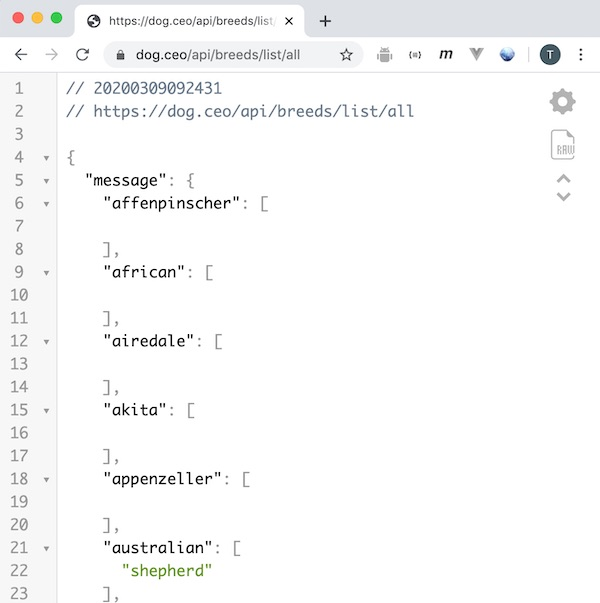
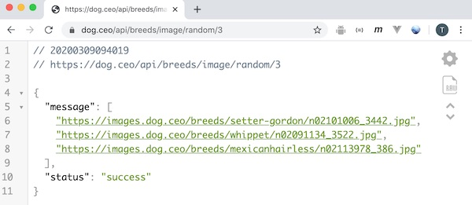
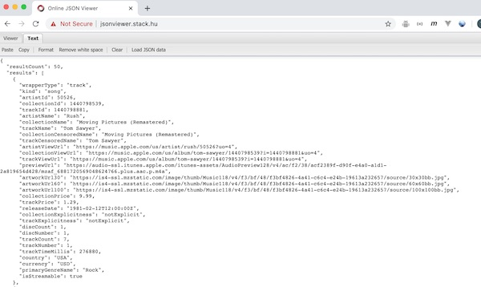

# PHP Web Service - I

## I. Overview

- In this series, we will *build our own web service* using the PHP programming language
- You have *used* web services before - by writing HTML/JS apps to download data from *existing web services*, and then formatted and displayed the results for your users
- You did this back in IGME-230/235 - go review those notes now:
  - [Web Apps 10 - Web Services](https://github.com/tonethar/IGME-230-Master/blob/master/notes/web-apps-10.md)
  - [Homework: GIF Finder](https://github.com/tonethar/IGME-230-Master/blob/master/notes/HW-gif-finder.md)
  - [Web Service App - Examples & Starters](https://github.com/tonethar/IGME-230-Master/blob/master/notes/web-service-app-starters.md)
  
### What's a web service, again?
  - The beginning of Wikipedia's [web service](https://en.wikipedia.org/wiki/Web_service) entry is very general and states: "a service offered by an electronic device to another electronic device, communicating with each other via the World Wide Web"
  - More specifically, in this class:
    - the service we will build and use in this class will return data in the JSON (**J**ava**S**cript **O**bject **N**otation) format 
    - the service will be a simple *read-only* web service that will return data, but cannot be written to or updated by the user of the service
    - we will pass in parameters (i.e. values help the user of service specify or filter the information they want back) to our web service using the [query string](https://en.wikipedia.org/wiki/Query_string)
    - we will also build a "client" (an HTML/JavaScript app) to download the web service via the [`XMLHttpRequest`](https://developer.mozilla.org/en-US/docs/Web/API/XMLHttpRequest) object and then display the results to a user

## II. Review - Example #1
- Here's another very simple web service, the [Dog API](https://dog.ceo/dog-api/)
- Let's look at the "List All Breeds" [endpoint](https://rapidapi.com/blog/api-glossary/endpoint/) - first. The documentation for this endpoint is here: 
  - https://dog.ceo/dog-api/documentation/
- and the actual endpoint (that gives you the data) is here:
  - https://dog.ceo/api/breeds/list/all
  - when we open this url up in a browser, we can see that this endpoint gives us a an array of dog breeds, nested inside of a JavaScript object literal - which is the JSON (**J**ava**S**cript **O**bject **N**otation) format.
  - For this url, there are no additional *parameters* to pass in, we ask for the "breeds/list/all" endpoint (also called a "route"), and we get back the full list of breeds

\*\* ***Does your JSON (below) not look as good in the browser as mine? Then go download the [JSON Viewer](https://chrome.google.com/webstore/detail/json-viewer/gbmdgpbipfallnflgajpaliibnhdgobh?hl=en-US) extension for Chrome*** \*\*

- JSON consists of *key* : *value* pairs, where the key is a string, and the value is one of these types: 
  - `Number`  - `123`, `1.23` etc
  - `String` - "Hello World" etc
  - `Boolean` - 'true' or 'false'
  - `Array` - `[1,2,3]`, `["Hello", "World"]` etc
  - `Object` -  *key* : *value* pairs - `{"name" : "Fred"}`
  - `null`

## III. Review - Example #2
- Here's the [Dog API](https://dog.ceo/dog-api/) again
- This time we'll look at the "Random image" endpoint - here is the documentation
  - https://dog.ceo/api/breeds/image/random
- and the actual endpoint (that gives you the data) is here:
  - https://dog.ceo/api/breeds/image/random
  - when we open this url up in a browser, we can see that this endpoint gives us a random url to a picture of a dog, formatted in JSON again
  - the `"message"` key contains a string, which is a URL to an image of a dog
  

  

 

  
- But one thing that makes this "Random image" endpoint different from the "List All Breeds" endpoint is that we can pass *parameters* into the service and modify the results we get, in this case, we can specify that we want more than one random image.
- This is done by a number end of the URL - like this:
  - https://dog.ceo/api/breeds/image/random/3
  - now the `"message"` key contains an array instead of a string
- Specifying parameters in this way - as part of the url path - is a "Restful" technique - https://en.wikipedia.org/wiki/Representational_state_transfer
- Note: When we build our PHP API - we will actually being passing parameters as a [query string](https://en.wikipedia.org/wiki/Query_string) - as can be seen in the next example
  

  
 ## IV. Review - Example #3
 
 - Now let's look at the iTunes Search API - the documentation is here:
   - https://developer.apple.com/library/archive/documentation/AudioVideo/Conceptual/iTuneSearchAPI/Searching.html
   - Here's an example call to the web service:
     - https://itunes.apple.com/search?media=music&entity=song&term=rush
     - this give us back textual information, thumbnail images and preview links for song tracks related to the search term "rush", formatted as a JSON string
     - Not that our values for the `media`, `entity` and `term` paramters are getting passed over in the [query string](https://en.wikipedia.org/wiki/Query_string):
       - the beginning of the query string is denoted with a question mark - `?`
       - the form of the query string is `name=value`, where multiple name:value pairs are separated by ampersands - `&`
    
 

    
 
   
 

