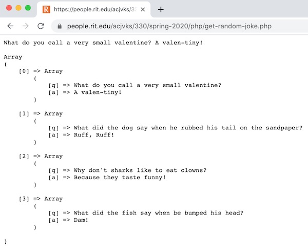

# PHP Web Service Part III - Coding the web service

[Overview](#overview)

[I. Get Started](#get-started)

[II. Add some content](#add-some-content)

[III. Get a random joke](#get-a-random-joke)

[IV. `echo()` a JSON string](#echo-a-json-string)

<hr><hr>

<a id="overview" />

## Overview
- Now that you know about PHP, we can finally get coding our web service!
- We are going to start out with **get-random-joke.php** - which returns a single random joke in JSON format
- Here's a "done" version you can check out: http://igm.rit.edu/~acjvks/courses/shared/330/php/get-random-joke.php

<hr>

<a id="get-started" />

## I. Get Started

- Here is your start file - go ahead and get this posted to banjo
- Open it up in your web browser, and be sure that you get similar outpout as the screenshot below before you continue

**get-random-joke.php**

```php
<?php
	/*
		Name: get-random-joke.php
		Description: Returns a single random joke in JSON format
		Author: 
		Last Modified: 
	*/
	
	// $jokes contains our data
	// this is an indexed array of associative arrays
	// the associative arrays are jokes -  they have an 'q' key and an 'a' key
	$jokes = [
		["q"=>"What do you call a very small valentine?","a"=>"A valen-tiny!"],
		["q"=>"What did the dog say when he rubbed his tail on the sandpaper?","a"=>"Ruff, Ruff!"],
		["q"=>"Why don't sharks like to eat clowns?","a"=>"Because they taste funny!"],
		["q"=>"What did the fish say when be bumped his head?","a"=>"Dam!"]
	];


	// Debugging - comment all these `echo()` statements out after you verify that everything works
	// print the first joke
	echo $jokes[0]["q"] . " " . $jokes[0]["a"]; 
	// print a blank line
	echo "\n\n"; 
	// print the entire array to the window
	print_r($jokes); 

?>
```


<hr>



<hr>

<a id="add-some-content" />

## II. Add some content

- Go ahead and add 4 (or more) jokes to the array
- Please keep them SFW - ***Safe For Work!***
- Preview your web service in Chrome to be sure that you didn't break anything

<hr>

<a id="get-random-joke" />

## III. Get random joke

- Use PHP's `array_rand()` to pull a random joke out of the array

```php
  // get a random element of the $jokes array
  // https://www.php.net/manual/en/function.array-rand.php
  // there are a bunch more PHP array functions at: http://php.net/manual/en/ref.array.php
  $randomKey = ...
  $randomJoke = ...
```

- comment out the "debug" `echo()` statements
- now echo out just a single random joke
- it should now look like this when you load it in a browser - reload the page multiple times to be sure that you're getting a single random joke - in regular "plain text":

<hr>


<hr>

<a id="echo-a-json-string" />

## IV. Echo a JSON string

- Now we are successfully echoing a random joke - but it's just in an unstructured text format
- Although it is quite possible to code a client app to use this text, web services almost always return data in either the XML or JSON formats
- **get-random-joke.php** is going to return the data in JSON format
- do you remember or know about `JSON.stringify()` in JavaScript? It turns any *object* - like an object literal or an array (because in JavaScript, arrays *are* objects) - into a string of JSON
- PHP has similar method called `json_encode()` - which turns PHP associative arrays (which is what `$jokes` and `$randomJoke` are) into a string of JSON
- So this is really easy - here's the code for you:

```php
  // json_encode() turns an associative array into a string of well-formed JSON
  // https://www.php.net/manual/en/function.json-encode.php
  $string = json_encode($randomJoke);
  echo $string;
```

- And here's what you should see in the browser (thanks for the nice formatting, JSON Viewer!)

<hr>


<hr>

<a id="sending-headers" />

## IV. Sending headers


<hr><hr>

**[Previous Chapter <- PHP Web Service - Part II](HW-php-web-service-2.md)**

**[Next Chapter -> PHP Web Service - Part IV](HW-php-web-service-4.md)**
