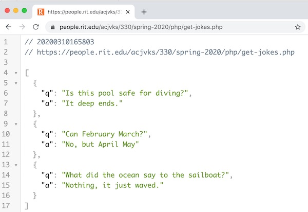
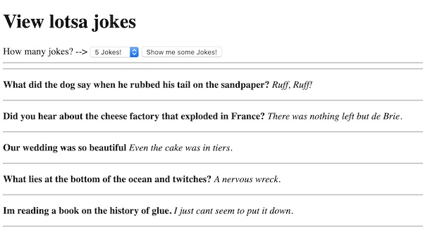

# PHP Web Service Part IV - Coding `get-jokes.php`


[Overview](#overview)

[I. Get Started](#get-started)

[II. Return exactly 3 jokes](#return-3-jokes)

[III. Check the query string for the number of jokes](#query-string)

[VI. A client app for testing your web service](#client-app)

[V. Discussion](#discussion)

[VI. Submission](#submission)


<hr><hr>

<a id="overview" />

## Overview

- last time we coded **get-random-joke.php**, which returned a single random joke
- this time, we'll code **get-jokes.php**, which will return 2 or more random jokes, in an array
- remember the **list of seven issues** we needed to consider as we built our web service? --> [HW-php-web-service-1.md#need](./HW-php-web-service-1.md#need)
  - #5 was *"we need a way for the client app to pass parameters to our web service"* - let's learn how to do that now
- Here's a "done" version you can check out (also, be sure to change the `limit` parameter to see what you get back): http://igm.rit.edu/~acjvks/courses/shared/330/php/get-jokes.php?limit=5

<hr>

<a id="get-started" />

## I. Get Started

- make a copy of **get-random-joke.php** from last time, and name it **get-jokes.php**
- modify the code to return the entire `$jokes` array instead of a single random joke:
  - you will have to change just one line of code
  - when you are done, **get-jokes.php** gives you these results in a web browser:
  
<hr>


<hr>

<a id="return-3-jokes" />

## II. Return exactly 3 jokes

- this time, let's create a variable named `$numJokes`, and that will be the number of random jokes that we will return in the array. For testing purposes, we'll hard-code that number at `3`
- we will "push" these jokes into an empty array named `$randomJokes`
- here's some code to get you started:

```php
  $numJokes = 3; // hard-code the number for now
  $randomJokes = []; // empty array
```

- here are some hints:
  - PHP's `array_rand()` can return more than one random key - go look at the docs:
    - https://www.php.net/manual/en/function.array-rand.php
  - you'll need to loop through the array of keys - check out our class notes o that:
    - https://github.com/tonethar/IGME-230-Master/blob/master/notes/php-3.md
  - PHP's `array_push()` will come in handy:
    - https://www.php.net/manual/en/function.array-push.php
  - when you are done, **get-jokes.php** should give you this in a web browser:

<hr>



<hr>
  

<a id="query-string" />

## III. Check the *query string* for the number of jokes

- rather than hard-coding a value like this - `$numJokes = 3;` - we want to instead pull it out of the *query string*
- meaning that the client application will be able to call the web service like this:
  - **get-jokes.php?limit=5**
  - and get 5 jokes back
  - BTW - `limit` is a common name for this kind of a parameter - it's from SQL ("Structured Query Language") and basically means *return no more than this many results*

### Parsing the query string

- it's pretty easy for PHP to grab the contents of the query string
- everytime a PHP script is invoked (either by XHR or just in the location box of a web browser), query string parameters are stored in a PHP "super global" associative array named `$_GET`
  - https://www.php.net/manual/en/reserved.variables.get.php
- let's test this out:
  - in **get-jokes.php**, temporarily comment out the `echo $string;` line of code
  - add this line of code to the bottom of the script:

```php
  print_r($_GET);
```

- now invoke it like this:
  - **get-jokes.php?limit=5&firstname=fred&lastname=Jones**
  - this passes in 3 parameters - `limit`, `firstname`, `lastname`
  - note that the `key=value` pairs are separated by ampersands
- you should see the following in a browser window:


```text
Array
(
    [limit] => 5
    [firstname] => fred
    [lastname] => Jones
)
```

- so to get at the value of `limit`, we just need to pass it as a key to `$_GET`, with square bracket syntax
- now temporarily add this line of code to the file, and test it in the browser:
  - `echo($_GET["limit"]); // pass in the 'limit' key, we should see '5' in the window`
  
### Using the value of the `limit` parameter

- Here's the code you need to use to get the value of `limit` from the query string
- Put this code at the top of your file, and somewhere in your code, make `$numJokes` equal to `$limit`:

```php
  $limit = 2; // the default
  if(array_key_exists('limit', $_GET)){
    $limit = $_GET['limit'];
    $limit = (int)$limit; // explicitly cast value to an integer
    if ($limit < 2){
      $limit = 2;
    }
  }
```

### Test the `limit` parameter in the query string

- try **get-jokes.php?limit=5**:
  - you should get 5 jokes back
- try **get-jokes.php?limit=-1**:
  - you should get 2 jokes back
- try **get-jokes.php?limit=fred%20jones&firstname=Scooby**:
  - you should get 2 jokes back, and the `firstname` parameter is ignored
- try **get-jokes.php?limit=9999**:
  - you'll see an error message in the browser because the second argument to `array_rand()` can't be more than the length of the array!
    - fix it using PHP's `count()` function to get the length of the array - https://www.php.net/manual/en/function.count.php - and then not allowing `$limit` to be larger than that number
    - if you are successful, **get-jokes.php?limit=9999** will instead return ALL of the jokes in the array
- BTW - why did we decide on a minimum of 2 results? It should really be zero:
  - Answer: to keeps things simple  - because the second argument to `array_rand()` can't be less than 2! Fix this issue if you want to
  
<hr>

<a id="client-app" />

## IV. A client app for testing your web service

- So we have now constructed another web service - but will it work with a client application?
- Go ahead and make a copy of **joke-client.html** from last time and name it **many-jokes-client.html**
- Give it a &lt;select> where the user can choose between 2 and 10 jokes - your HTML looks like this

```html
<body>
	<h1>View lotsa jokes</h1>
	How many jokes? -->
	<select id="numJokesElement">
		<option value="2">2 Jokes!</option>
		<option value="3">3 Jokes!</option>
		<option value="4">4 Jokes!</option>
		<option value="5" selected>5 Jokes!</option>
		<option value="6">6 Jokes!</option>
		<option value="7">7 Jokes!</option>
		<option value="8">8 Jokes!</option>
		<option value="9">9 Jokes!</option>
		<option value="10">10 Jokes!</option>
	</select>
	<button id="jokeBtn">Show me some Jokes!</button>
	<hr><hr>
	<div id="content">
	
	</div>
</body>
```

- now use the `.value` of this select to change the value of the `limit` parameter you will be sending to **get-jokes.php**
- fetch and show all of these jokes when the user clicks the button, and be sure to clear out the old results. Put the jokes in the `#content` &lt;div>
- when you are done, it will look something like this:

**many-jokes-client.html**

<hr>



<hr>

<a id="discussion" />

## V. Discussion
- So we now have a functioning web service, and a client app to utilize it, well done!
- But how could we make this "jokes" web service better? Here are some ideas (just for discussion, you don't have to do this!):
  - add more jokes
  - right now we have 2 different PHP files (**get-jokes.php** & **get-random-joke.php**) with separate copies of the same hard-coded data. Instead, place the `$jokes` array in a third PHP file and link to it from the other 2 PHP files with PHP's `include()` function
  - give the jokes a `rating` attribute between 0 and 5
  - give the jokes a `tags` attribute - this would contain a comma separated list of keywords that describe that joke - for example:
    - "kids", "corny", "ethnic", "military", "old-age", "teen", "young-adult" and so on
  - allow the client to request random jokes based on these criteria - for example:
    - **get-jokes.php?limit=5&tag=kids&minrating=3**
    - you will need to write this search functionality yourself, obviously. PHP has an `array_filter()` function that would help
    - change the minimum number of jokes to be returned in the array to `0` instead of `2`, and use PHP's `define()` to create a `MIN_RESULTS` constant 
  - get rid of the `$jokes` array and instead store the jokes data in a [SQLite](https://www.sqlitetutorial.net/sqlite-php/) relational database:
    - you could then use SQL ("Structured Query Language") to do your searches with statements like ["SELECT * FROM jokes WHERE minrating >= 3"](https://www.w3schools.com/sql/sql_where.asp)
    - Fun Fact - Thanks to smart phones, SQLite is the most widely used database engine in the world
  - create an "admin" web page to allow an administrator to Create, Read, Update, and Delete your jokes (the C.R.U.D. operations)
  - create a form (and another web service) that a user could fill out and use to submit new joke suggestions
  

<hr>

<a id="submission" />

## VI. Submission

- POST **get-jokes.php** and **many-jokes-client** to your banjo account (they will probably be in the same folder, but they don't have to be!
- ZIP and POST **get-jokes.php** and **many-jokes-client** to the myCourses dropbox
- Type the banjo links to **get-jokes.php** and **many-jokes-client** into the comments field of the dropbox


<hr><hr>

**[Previous Chapter <- PHP Web Service - Part III](HW-php-web-service-3.md)**
