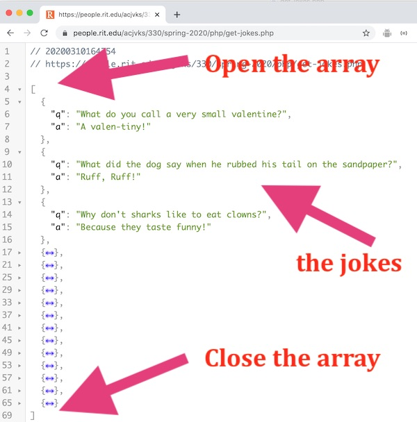

# PHP Web Service Part IV - Coding get-jokes.php


[Overview](#overview)

[I. Get Started](#get-started)

[II. Return exactly 3 jokes](#return-3-jokes)


<hr><hr>

<a id="overview" />

## Overview

- last time we coded **get-random-joke.php**, which returned a single random joke
- this time, we'll code **get-jokes.php**, which will return 1 or more random jokes, in an array

<hr>

<a id="get-started" />

## I. Get Started

- make a copy of **get-random-joke.php** from last time, and name it **get-jokes.php**
- modify the code to return the entire `$jokes` array instead of a single random joke:
  - you will have to change just one like of code
  - when you are done, **get-jokes.php** gives you these results in a web browser:
  
<hr>



<hr>

<a id="return-3-jokes" />

## II. Return exactly 3 jokes

- this time, let's create a variable named `$numJokes`, and that will be the number of random jokes that we will return in the array. For testing purposes, we'll hard-code that number at `3`
- we will "push" these jokes into an empty array named `$randomJokes`
- here's some code to get you started:

```php
  $numJokes = 3; // hard-code the number for now
  $randomJokes = []; // empty array
```

- here are some hints:
  - PHP's `array_rand()` can return more than one random key - go look at the docs:
    - https://www.php.net/manual/en/function.array-rand.php
  - you'll need to loop through the array of keys - check out our class notes o that:
    - https://github.com/tonethar/IGME-230-Master/blob/master/notes/php-3.md
  - PHP's `array_push()` will come in handy:
    - https://www.php.net/manual/en/function.array-push.php
  - when you are done, **get-jokes.php** should give you this in a web browser:

<hr>


<hr>
  

<a id="query-string" />

## III. Check the *query string* for the number of jokes

- rather than hard-coding a value like this - `$numJokes = 3;` - we want to instead pull it out of the *query string*
- meaning that the client application will be able to call the web service like this:
  - **get-jokes.php?limit=5**
  - and get 5 jokes back
  - BTW - `limit` is a common name for this kind of a parameter - it's from SQL ("Structured Query Language") and basically means *return no more than this many results*

### Parsing the query string

- it's pretty easy for PHP to grab the contents of the query string
- everytime a PHP script is invoked (either by XHR or just in the location box of a web browser), query string parameters are stored in a PHP "super global" associative array named `$_GET`
  - https://www.php.net/manual/en/reserved.variables.get.php
- let's test this out:
  - in **get-jokes.php**, temporarily comment out the `echo $string;` line of code
  - add this line of code to the bottom of the script:

```php
  print_r($_GET);
```


<hr><hr>

**[Previous Chapter <- PHP Web Service - Part III](HW-php-web-service-3.md)**
