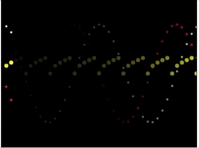

# HW - Sine Wave

## I. Overview
- As we know from Trigomometry, the *sine function* is the ratio of the length of the side that is opposite that angle to the length of the longest side of the triangle (the hypotenuse).
- A *sine wave* is a mathematical curve that describes a smooth periodic oscillation. 
- You might also know that in 1822, French mathematician Joseph Fourier discovered that sine waves can be used as building blocks to describe and approximate any periodic waveform.
- The sine wave pattern is often approximated in nature, including wind waves, sound waves, and light waves.
- We can use them to create a natural "ease" in a computer animation 
- Sine waves are cool! Let's go ahead and draw some now!



## II. Handy Links
- https://en.wikipedia.org/wiki/Sine
- https://en.wikipedia.org/wiki/Sine_wave

## III. Video Links

- [Sine Wave-1 (10:31)](https://video.rit.edu/Watch/sine-wave-1) - Drawing a static Sine wave
- [Sine Wave-2 (11:04)](https://video.rit.edu/Watch/sine-wave-2) - Drawing a animated Sine wave:
  - think about controls that could speed up or slow down the speed the waves are drawn, increase/decrease the *frequency* of the waves, and/or increase/decrease the *amplitude* of the waves.
  - PS: a better name for the `counter` variable in this video is `angle`

## IV. Start Code

**sine-start.html**

```html
<!DOCTYPE html>
<html lang="en">
<head>
	<meta charset="utf-8" />
	<title>Sine Start</title>
	<style>canvas{ border: 1px solid black; }</style>
	<script>
	"use strict";
	const canvasWidth = 400, canvasHeight = 300;
	let ctx;

	function init(){
		ctx = canvas.getContext("2d");
		canvas.width = canvasWidth;
		canvas.height = canvasHeight;
		ctx.fillRect(0,0,canvasWidth,canvasHeight);
	}


	// helpers
	function dtr(degrees){
		return degrees * (Math.PI/180);
	}

	function drawCircle(ctx,x,y,radius,color){
		ctx.save();
		ctx.fillStyle = color;
		ctx.beginPath();
		ctx.arc(x,y,radius,0,Math.PI * 2);
		ctx.closePath();
		ctx.fill();
		ctx.restore();
	}

	</script>
</head>
<body>
<canvas id="canvas"></canvas>

</body>
</html>
```
