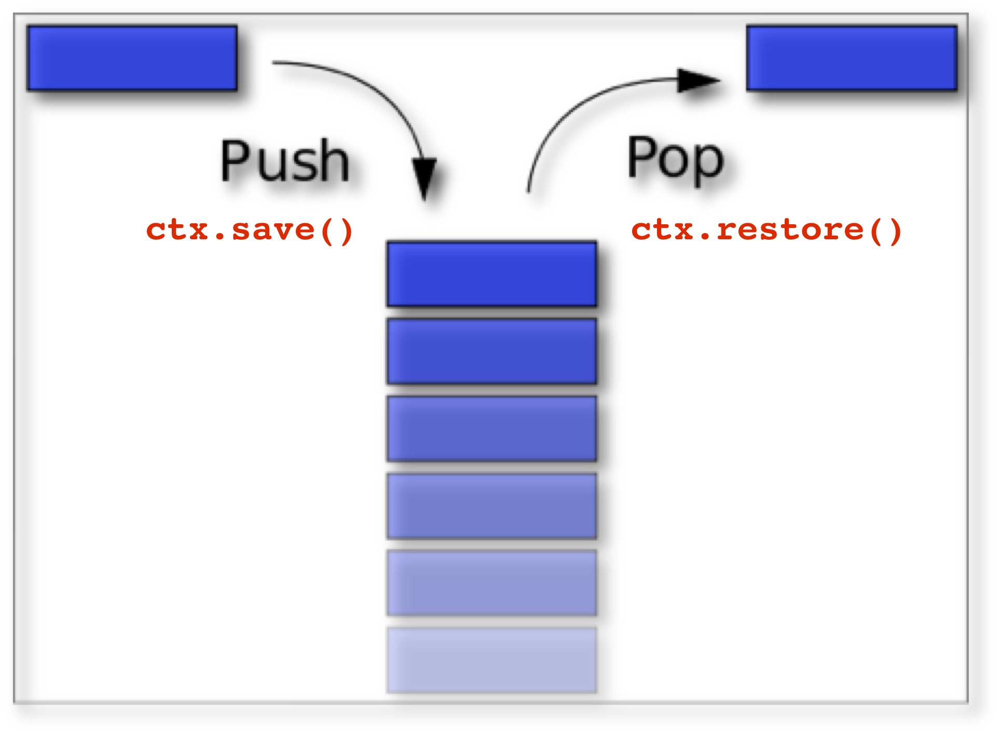
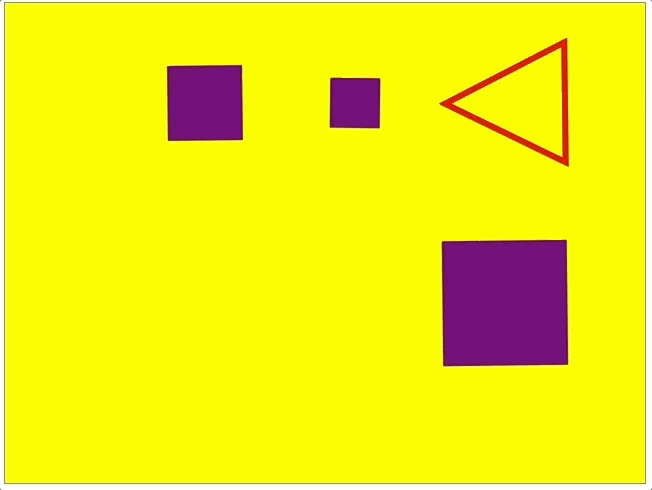

# III - Canvas Transformations

## I. Overview

- Here we will look at canvas *transformations* (translate, rotate, scale) and how to combine them with `ctx.save()` and `ctx.restore()` to create interesting effects.

## II. Presentation

1. Manipulating the drawing state stack via `ctx.save()` and `ctx.restore()`
2. the **Current Transformation Matrix** (CTM)
  - `ctx.translate()`
  - `ctx.rotate()`
  - `ctx.scale()`
3. What is the drawing state "stack"? 
  - the drawing state "stack" is a "snapshot" of the current value of drawing attributes and transformations. Here is what is included in it:
    - **drawing attributes** (i.e. styles or properties):  `strokeStyle, fillStyle, globalAlpha, lineWidth, lineCap, lineJoin, miterLimit, shadowOffsetX, shadowOffsetY, shadowBlur, shadowColor, globalCompositeOperation, font, textAlign, textBaseline`
    - The **clipping region** - there is a `ctx.clip()` method, and we also saw clipping in action with the "ring" and "donut" we created last time
    - the **CTM** - *current transformation matrix* (translations + rotations + scales via `ctx.translate()`, `ctx.rotate()`, `ctx.scale()`, and `ctx.setTransform()`)

## III. Demo A

Here's our start file:

**canvas-transforms-demo-start.html**

```html
<!DOCTYPE html>
<html lang="en">
<head>
	<meta charset="utf-8" />
	<title>Canvas Transforms Starter</title>
	<style>
	canvas{
		border:1px solid gray;
	}
	</style>
</head>
<body>
	<canvas width="640" height="480">
		Get a real browser!
	</canvas>
	<script>
		'use strict';
		
		init();
	
		function init(){
			let ctx = document.querySelector('canvas').getContext('2d');
			// background
			
			ctx.fillStyle = 'yellow'; 
			ctx.fillRect(0,0,640,480); 
	
			// do some transformations?
			//ctx.translate(100,0);
			//ctx.rotate(Math.PI/6);
			//ctx.scale(1.2,1.2);
			
			
			// set a bunch of state attributes
			// ctx.shadowOffsetX = 15;
			// ctx.shadowOffsetY = 15;
			// ctx.shadowColor = "rgba(153,50,204,.6)";
			// ctx.shadowBlur = 5;
		
		
			// draw square with fillRect() convenience method
			ctx.fillStyle="green";
			ctx.fillRect(100,100,100,100);
		
			// draw square with rect()
			ctx.fillStyle="blue";
			ctx.beginPath();
			ctx.rect(300,100,100,100);
			ctx.closePath();
			ctx.fill();
			
			// draw squares with our helper function
			drawSquare1(ctx,100,0,100,100,"orange");
			drawSquare1(ctx,250,0,100,100,"orange");
			drawSquare1(ctx,400,0,100,100,"orange");
		
			// draw a triangle
			ctx.strokeStyle="red";
			ctx.fillStyle="red";
			ctx.lineWidth="5";
			ctx.beginPath();
			ctx.moveTo(500,100);
			ctx.lineTo(550,200);
			ctx.lineTo(450,200);
			ctx.closePath();
			ctx.stroke();
			
			// draw a "better" triangle - why is this better? You'll see!
			// ctx.strokeStyle="red";
// 			ctx.fillStyle="red";
// 			ctx.lineWidth="5";
// 			ctx.beginPath();
// 			ctx.moveTo(0,-50);
// 			ctx.lineTo(50,50);
// 			ctx.lineTo(-50,50);
// 			ctx.closePath();
// 			ctx.stroke();
		}
		

		function drawSquare1(ctx,x,y,width,height,fillStyle){
			ctx.save();
			ctx.fillStyle=fillStyle;
			ctx.fillRect(x,y,width,height);
			ctx.restore();
		}
	</script>
</body>
</html>
```


### Demo A.

1. In **canvas-transforms-demo-start.html**, let's make some drawing changes to just our first green square.  We will see that using `ctx.save()` and `ctx.restore` helps to make this easier

2. Let's next try *translating*, then *scaling*, then *rotating* the squares -  how are the results unexpected?  `ctx.save()` and `ctx.restore` to the rescue!

3. How about the triangles -  how are the results unexpected? Once again, `ctx.save()` and `ctx.restore` to the rescue!

4. Now now we will create some animation by letting our transformations accumulate over time




### Done Version




## IV. Demo-B - *Revenge of Screen Saver!*
- Let's use our knowledge of scale and rotate to create another screensaver!
- Here's the start code:

**screen-saver-2-start.html**


```html
<!DOCTYPE html>
<html lang="en">
<head>
	<meta charset="utf-8" />
	<title>Screensaver - now with rotations!</title>
	<style type="text/css">
	canvas{
		border:1px solid gray;
	}
	</style>
</head>
<body>
	<canvas width="640" height="480">
		Get a real browser!
	</canvas>
</body>
	<script>
	'use strict';
		
	let ctx = document.querySelector('canvas').getContext('2d');
	let rotation = 0;
	let rotationSpeed = .05;
	let transformAmount = 0;
	let strokeStyle = "black";

	init();
	function init(){
		// 1 - draw background
		fillBGWithRandomTint()
		
		// 2 - schedule some code to fire at regular intervals
	
		
		// 3 - start the animation loop
		loop();
	}
	
	
	function loop(){
	//	requestAnimationFrame(loop);
		ctx.save();
	//	ctx.translate(320, 240);
	//	ctx.scale(.5, .5);
		ctx.rotate(rotation);
		ctx.lineWidth=1;
		ctx.linePath = "round";
		ctx.lineJoin = "round";
		ctx.beginPath()
		ctx.moveTo(40, 400);
		ctx.bezierCurveTo(420, 78, 178, 93, 600, 400);
		ctx.lineTo(40,400);
		ctx.closePath();
		ctx.strokeStyle = strokeStyle;
		ctx.stroke();
		ctx.restore();
	//	rotation += rotationSpeed;
	//	transformAmount += .1;
	}

	function fillBGWithRandomTint(){
		ctx.save();
		ctx.fillStyle = getRandomColor(); 
		ctx.globalAlpha = 0.3;
		ctx.fillRect(0,0,640,480);
		ctx.restore();
		
	}

	function getRandomColor(){
			function getByte(){
				return 55 + Math.round(Math.random() * 200);
			}
			return "rgba(" + getByte() + "," + getByte() + "," + getByte() + ",1)";
		}
	</script>
</html>
```

**Done versions:**


## V. Try it yourself

- Try It! *(Optional Practice)* --> [HW-try-it.md](./HW-try-it.md)

## VI. Reference

- https://developer.mozilla.org/en-US/docs/Web/API/Canvas_API/Tutorial/Transformations


## VII. Videos of lecture & demos

We aren't always going to have video links, but here is a re-cap of the canvas transforms & drawing state stack demo:

- [Week 2B - part-I - Drawing State Stack (05:25)](https://video.rit.edu/Watch/m7Q4Pfd9):
  - look at start code
  - use `ctx.save()`/`ctx.restore()`/drawing state stack to apply shadow effects to the green rectangle ONLY
- [Week 2B - part II - Transformations (10:05)](https://video.rit.edu/Watch/x2N4Kaf6)
- [Week 2B - part III - More Transformations (06:08)](https://video.rit.edu/Watch/Hj7i4P9T)
- [Week 2B - part IV - Animating Rotations (08:39)](https://video.rit.edu/Watch/Nx83ApHn)

<hr><hr>

**[Previous Chapter <- Canvas Part II](canvas-2.md)**
