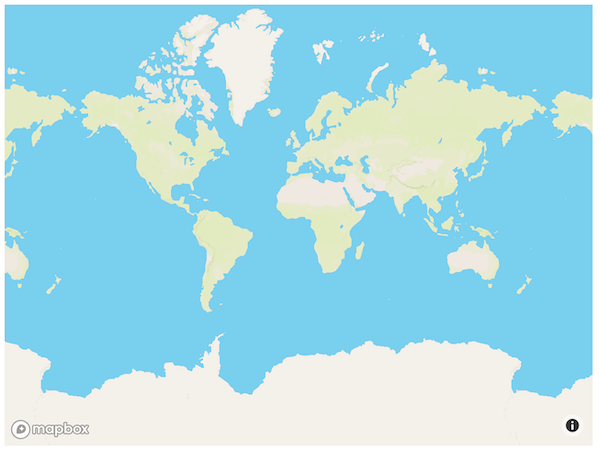
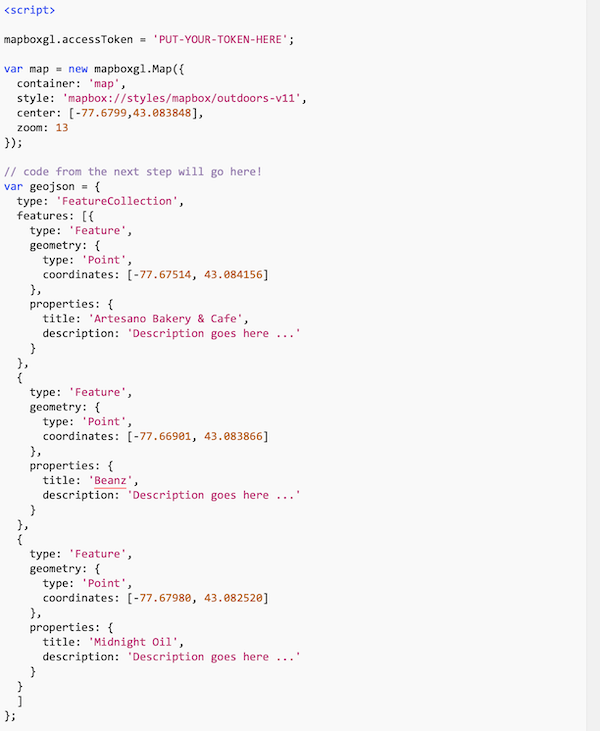
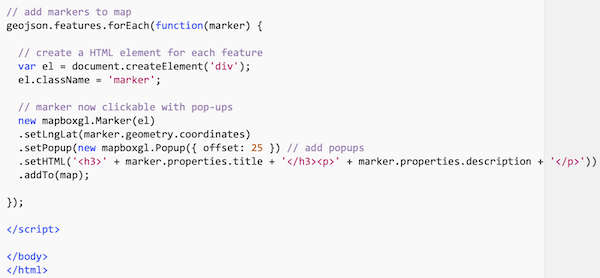
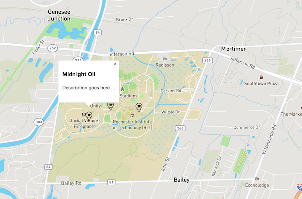

# Mapbox Intro


- An alternative to google maps is Mapbox - let's check it out.


## I. Get Started

1. Sign up for an account here: https://account.mapbox.com/auth/signup/
2. On the account page - https://account.mapbox.com
3. Click the "Start by designing a map" button:
  - Choose "JS Web"
  - Choose "Use the Mapbox CDN"
  - Create an empty HTML page named **mapbox-start.html**
  - Follow the instructions and add the `&lt;link>`and `&lt;script>` tags, as well as the JS and HTML, to the page
  - Note that you will be given your Mapbox access token - keep a copy of it somewhere


**Here's what the HTML page will look like - you'll need to add your *access token* to it:**

**mapbox-start.html**

```html
<!DOCTYPE html>
<html lang="en">
<head>
	<meta charset="utf-8" />
	<title>Map Start</title>
	<script src='https://api.mapbox.com/mapbox-gl-js/v1.8.1/mapbox-gl.js'></script>
	<link href='https://api.mapbox.com/mapbox-gl-js/v1.8.1/mapbox-gl.css' rel='stylesheet' />
</head>
<body>
<div id='map' style='width: 400px; height: 300px;'></div>
<script>
	mapboxgl.accessToken = 'ACCESS-TOKEN-GOES-HERE';
	var map = new mapboxgl.Map({
	container: 'map',
	style: 'mapbox://styles/mapbox/streets-v11'
	});
</script>

</body>
</html>
```

<hr>

## II. Test it

Screenshot of **mapbox-start.html** (I changed the `width` & `height` in my version):




<hr>

## I-A. Some things to try

- Change the map's `style` - https://docs.mapbox.com/mapbox-gl-js/example/setstyle/ - by changing `streets-v11` above to 
  - `light-v10` OR
  - `dark-v10` OR
  - `outdoors-v11` OR
  - `satellite-v9`
- Change the `center` and `zoom` of the map:

```js
map.setZoom(9);
map.setCenter([-77.6799,43.083848]); // note the order - it's longitude,latitude - which is opposite of Google Maps
```

<hr>

## II. Add Clickable Markers

- Here is a marker icon you will need (right-click to download) --> 

- Follow this tutorial here - https://docs.mapbox.com/help/tutorials/custom-markers-gl-js/ - which give you something that looks like this:


<hr>

## III. RIT Coffee Map

- Here is a marker icon you will need (right-click to download) --> 
- To get started on the RIT coffee map, we just have to slightly modify the above tutorial - here's a screenshot of the code, and the final result (with 3 coffee shops showing)

**rit-coffee-mapbox.html**






Screenshot of **rit-coffee-mapbox.html**:




