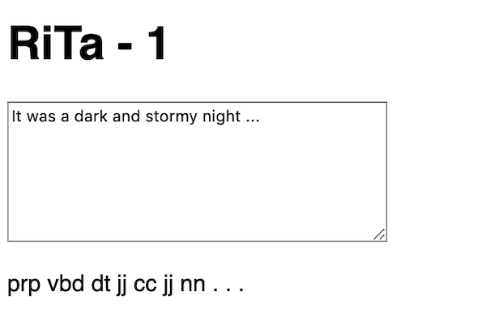
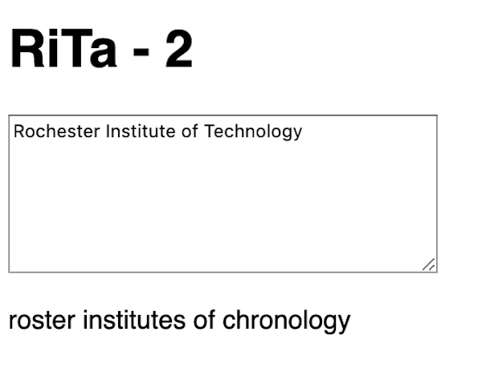
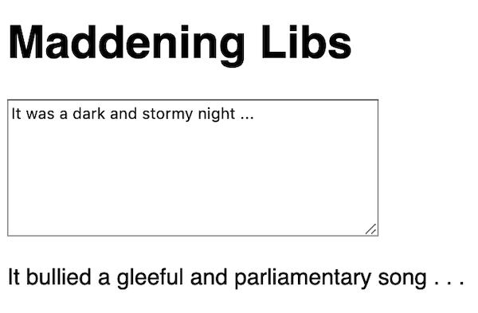
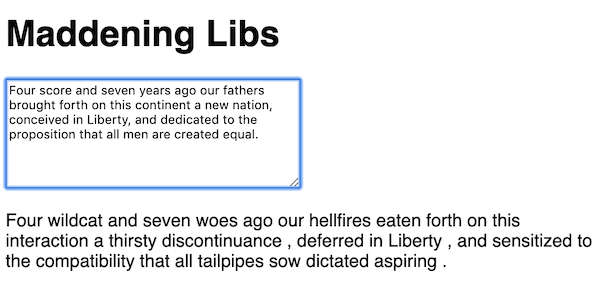

# 4 - The RiTa.js Computational Text Library

## I. Overview
- RiTa is a "software toolkit for computational literature"
- Documentation of the JavaScript version of RiTa is here: 
  - http://rednoise.org/rita/
  - http://rednoise.org/rita/reference/index.php
  - https://github.com/dhowe/RiTaJS
- Some of RiTa's capabilities:
  - *text tagging* - get the part of speech of a word - such as *adjective*, *verb*, *noun*, *proper noun*, *pronoun* etc  - from the PENN part of speech tags: http://rednoise.org/rita/reference/PennTags.html
    - https://en.wikipedia.org/wiki/Part-of-speech_tagging
  - *verb conjugation* and *pluralization*
  - *text generation* via context-free grammars
  
<hr><hr>

## II. Demo

### II-A. Create the Demo File
- To follow along on the demo and have a start file for the Homework, go ahead and grab the **load-text-textarea.html** file we have at [text-1.md](text-1.md#I-B)
- Change the &lt;title> & &lt;h1> text to "RiTa - 1"
- name the file **rita-1.html**
- delete the `input.onchange = doChange;` line of JS, and the `doChange()` event handler (we don't need them)
- Now you need to import the RiTa.js library. There is a CDN for RiTa.ja here - look for the **rita-full.js** file here: https://cdnjs.com/libraries/rita - grab the URL and add a &lt;script> tag to the &lt;head> section of your start file
- Now open up the console - you should see the current version of RiTa logged out - someting like `[INFO] RiTaJS.version [1.3.89]`

### II-B. The RiTa.js library

- We now have 7 top-level objects to work with: `RiTa`, `RiString`, `RiGrammar`, `RiMarkov`, `RiWordNet`, `RiLexicon` and `RiTaEvent`
- Let's type in each of the commands listed below into the console, in order to see that they do. The docs for all of the RiTa methods are here: http://rednoise.org/rita/reference/index.php
  - These commands use the RiTa *lexicon* - a lexicon is a set of words, and information about these words - their pronunication and part-of-speech for example. RiTa's lexicon is approximately 40,000 words - https://rednoise.org/rita/reference/RiLexicon.php
    - `RiTa.randomWord("nn")` - a random noun - full list of POS tags are here: http://rednoise.org/rita/reference/PennTags.html
    - `RiTa.rhymes("computer")`
    - `RiTa.pluralize("computer")`
    - `RiTa.singularize("people")`
    - `RiTa.alliterations("games")`
    - `RiTa.isRhyme("cat", "hat")`
    - `RiTa.similarByLetter("rochester")`
    - `RiTa.similarBySound("institute")`
    - `RiTa.similarBySoundAndLetter("technology")`
  
  - RiTa can also tell us about the parts of speech of a sentence:
     - `RiTa.isNoun("computer")`
     - `RiTa.isVerb("take")`
     - `RiTa.getPastParticiple("take")`
     - `RiTa.getPresentParticiple("take")`
     - `let rs = RiString("The elephant took a bite!")` - creates a [`RiString`](http://rednoise.org/rita/reference/RiString.php) object
     - `rs.analyze()` - lot's of info!
     - `rs._features.phonemes`
     - `rs._features.syllables`
     - `rs.pos()` - gets the parts-of-speech of the string in an array
     - `rs.posAt(1)` - gets the part-of-speech of the second word
     - `rs.words()` - tokenizes the sentence and puts the tokens into an array
     
### II-C. Part-of-speech "displayer"

- Now let's modify **rita-1.html** and try out some of these RiTa features we tried out above.
- What we would like to do is to display the part of speech for each word that is in the text area. This is pretty easy, here's what `doInput()` needs to look like:

```js
function doInput(e){
	let text = e.target.value;
	if (text.length == 0) return;
	let rs = RiString(text);
	let pos = rs.pos()
	
	let s = "";
	for(let item of pos){
		s += item + " ";
	}
	
	output.innerHTML = s;
}
```

- Which displays the PENN tags for you and looks something like this:



- So the first word is a personal pronoun, and the second word is a past tense verb and so on. Let's make this a little more human readable - here's a JavaScript dictionary (object) that has the full names for these tags - add this to your JS:

```js
let POS = {
	"cc":"Coordinating conjunction",
	"dt":"Determiner",
	"jj":"Adjective",
	"nn":"Noun, singular or mass",
	"prp":"Personal pronoun",
	"vbd":"Verb, past tense"
};
```

- Reminder - these POS tags are listed here: http://rednoise.org/rita/reference/PennTags.html
- You will also need to modify the loop to look like this:

```js
let s = "<ul>";
for(let item of pos){
  let desc = POS[item];
  if(desc == undefined) desc = "??"
  s += `<li><b>${item}</b> : ${desc}</li>`;
}
s += "</ul>";
output.innerHTML = s;
```

- Reload the page, here are the results:


- try typing in new words - you should see the part-of-speech tags appear for the new words. Obviously you will need to expand the `POS` dictionary to include all of the full names of these tags
- to get rid of the unwanted punctuation, add a call to `RiTa.isPunctuation()` for each `item`, and then `continue` if it returns `true`


### II-D. Proper Noun "replacer"

- How about trying to replace all of the proper nouns of a sentence with *similar* words pulled from RiTa?
- Rename **rita-1.html** to **rita-2.html**
- Change the &lt;title> & &lt;h1> text to "RiTa - 2"
- Hints: 
  - use `RiString()` and `.words()` like we did in the console demo
  - the "similarBy" methods return an array - you need to pull out a random element of that array
  - you don't need the `POS` object anymore ...
- Give it a try - see below for an example:



<hr><hr>

## III. Homework Assignment - *Maddening Libs*

- Rename **rita-2.html** to **maddening-libs.html**
- Change the &lt;title> & &lt;h1> text to "Maddening Libs"
- Modify the example above so that it will:
  - replace all nouns and plural nouns, with a random noun or random plural noun
  - replace all adjectives (there are 3 tags), with a random adjective of the same type
  - replace all verbs (there are 6 tags), with a random verb of the same type
- Here is a screen shot of an example:



**OR**



<hr><hr>

**[Previous Chapter <-  Simple Text Analysis (Part III)](text-3.md)**

**[Next Chapter -> Context Free Grammars (Part V)](text-5.md)**
