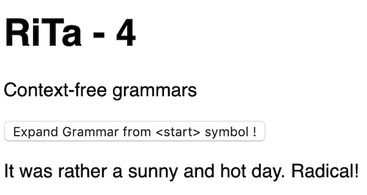
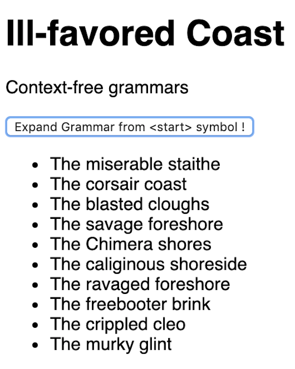

# 5 - Context-free Grammars

## I. Overview

- Today we will look at creating generative text using the RiTa library
- Creating text that isn't just random gibberish requires specifying a *grammar*
- What's a grammar? 
  - *In formal language theory, a grammar is a set of production rules for strings in a formal language. The rules describe how to form strings from the language's alphabet that are valid according to the language's syntax. A grammar does not describe the meaning of the strings or what can be done with them in whatever context — only their form.* - https://en.wikipedia.org/wiki/Formal_grammar
  - Grammar is the “language of languages”. Behind every language, there is a grammar that determines its structure
  - A language could be a human language, or a computing language like JavaScript
  - A *Context-Free Grammar* is a set of rules that define the syntax of a language — what is and is not a valid sequence of *tokens*
  - Natural languages can be described using [Context-sensitive grammars](https://en.wikipedia.org/wiki/Context-sensitive_grammar), a concept introduced by Noam Chomsky in the 50s.
- What can you do with them?
  - http://rednoise.org/rita/gallery.php

<hr>

## II. 1st Demo Start File


**rita-3.html**

```html
<!DOCTYPE html>
<html lang="en">
<head>
	<meta charset="utf-8" />
	<title>RiTa - 3</title>
	<script src="https://cdnjs.cloudflare.com/ajax/libs/rita/1.3.89/rita-full.js"></script>
	<style>
		body{font-family:sans-serif;}
	</style>
</head>
<body>
<h1>RiTa - 3</h1>
<p>Context-free grammars</p>
<section>
	<button>Expand Grammar from &lt;start> symbol !</button>
	<p id="output">It was a dark and stormy night.</p>
</section>
<script>

let output = document.querySelector("#output");
document.querySelector("button").onclick = doClick;

function doClick(){
	let grammar = new RiGrammar();
	grammar.addRule("<start>", "It was a <adj1> and <adj2> <noun>.");
	grammar.addRule("<adj1>", "bright | cold | cloudy | dark | overcast | sunny");
	grammar.addRule("<adj2>", "dry | frigid | hot | rainy | wet");
	grammar.addRule("<noun>", "afternoon | day | mid-day | morning | night | twilight");

	let story = grammar.expand();
	output.innerHTML = story;
}

</script>
</body>
</html>
```

- Load the page - the text will be "It was a dark and stormy night."
- Click the button. You will get results like "It was a bright and dry twilight." and "It was a cloudy and wet afternoon."
- You can also *weight* a rule - add the following to the code above:

```js
grammar.addRule("<adj2>", "stormy",2); // "stormy" will now appear twice as often as the other <adj2> options
```

<hr>

## III. Discussion

- Grammars consist of an alphabet of *terminal* and *non-terminal* symbols, and *production rules*
- In the example above, when the grammar is expanded, the *non-terminal* symbols (like &lt;adj1> and &lt;noun>) are expanded and replaced by (random) *terminal* symbols
- *terminal* symbols cannot be expanded, and in the above example words like "bright" and "cold" are *terminal* symbols 
- Which **rule** is the root or starting rule? RiTa will begin with a non-terminal symbol named &lt;start>

<hr>

## IV. Load a grammar from a file, and nested non-terminal symbols

- Below we will load in a grammar from a JSON object (you could also load JSON from a file with `grammar.loadFrom("my-grammar.json", callbackFunction)`)
- Note that our `<verb-phrase>` *non-terminal* symbol contains 2 more *non-terminal* symbols (`<verb>` and `<pre-determiner>`) that will be expanded until a *terminal* symbol is reached

**rita-4.html**

```html
<!DOCTYPE html>
<html lang="en">
<head>
	<meta charset="utf-8" />
	<title>RiTa - 4</title>
	<script src="https://cdnjs.cloudflare.com/ajax/libs/rita/1.3.89/rita-full.js"></script>
	<style>
		body{font-family:sans-serif;}
	</style>
</head>
<body>
<h1>RiTa - 4</h1>
<p>Context-free grammars</p>
<section>
	<button>Expand Grammar from &lt;start> symbol !</button>
	<p id="output">It was quite a dark and stormy night!</p>
</section>
<script>
let darkGrammar = { // NEW
	"<start>" : ["It <verb-phrase> a <adj1> and <adj2> <noun>!"],
	"<verb-phrase>" : ["<verb> <pre-determiner>"],
	"<verb>" : ["was","wasn't"],
	"<pre-determiner>" : ["such", "rather", "quite"],
	"<adj1>" : ["bright","cold","cloudy","dark","overcast","sunny"],
	"<adj2>" : ["dry","frigid","hot","rainy","stormy","wet"],
	"<noun>" : ["afternoon","day","mid-day","morning","night","twilight"]
};

let output = document.querySelector("#output");
let grammar = new RiGrammar(darkGrammar); // NEW
let button = document.querySelector("button");
button.onclick = doClick;
button.dispatchEvent(new Event("click"));


function doClick(){
	let story = grammar.expand();
	output.innerHTML = story;
}

</script>
</body>
</html>
```

- **Try it:** - add an *interjection* non-terminal symbol to the end of the &lt;start> sentence above. Now define the &lt;interjection> symbol - and use *terminal symbols* (i.e. words like *Cool*, *Nice*, *Yeah*, *Bummer*, *Radical*)
- See final results below:



<hr>

## V. Homework - easy!

- You will build a fantasy "place name" generator - in this case a random "lost coast" name of some kind
- Here's the blog post we will use as inspiration and as a source of possible names: https://heredragonsabound.blogspot.com/2018/06/the-naming-of-places-part-3-lost-coast.html
- Note that the poster has a list of nouns ("coast", "foreshore", "bracks", "shore", ...) and adjectives ("forgotten", "bitter", "trackless", "cursed", ...) we can use (thanks for doing the research!)
- Use **rita-4.html** as a starting point:
  - name the file **ill-favored-coast.html**
  - encode your grammar in a JSON object
  - use a least 10 nouns and 10 adjectives
  - utilize a loop so that user can see 10 random names everytime they click the button
  - see example below:
  
  

 - Obviously, this HW is very simple, and you wouldn't actually need a grammar library to do this, but there are many other applications where libraries like this come in handy when you are building games or interactive experiences (placenames, dialog, flavor text, and so on). 
 - What else could you use this for? These grammars and production rules are used to produce text - but you are not limited to that usage.  The text could also represent (for example) terrain characterstics for a game level, or RGB values for an image, or notes to be used in a MIDI composition and so on
 - If we have time, we'll look at a [Haiku](https://grammar.yourdictionary.com/style-and-usage/rules-for-writing-haiku.html) example together in class. See myCourses for the complete files.

<hr><hr>

**[Previous Chapter <-  The RiTa.js Computational Text Library (Part IV)](text-4.md)**
